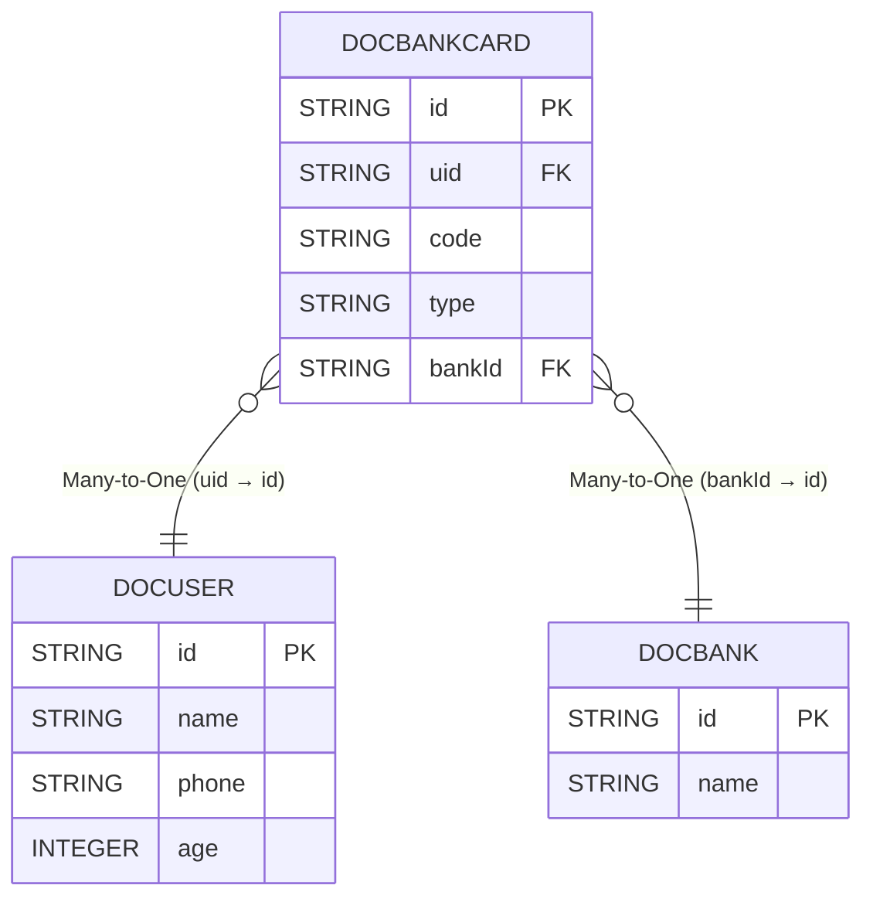

`隐式Group`使用api`subQueryToGroupJoin`用来处理ORM在OLAP领域的最后一块短板,可以说这个功能是目前现有orm都不存在的一个功能

- 体验和隐式子查询一样
- 多条件自动合并到隐式group中
- 智能处理多个表之前的join关系


::: tip 体验!!!
> 隐式子查询的体验,和高性能的sql生成,谁说鱼和熊掌不可兼得！！！！！
:::


## api
`subQueryToGroupJoin`将对象关系`XToMany`转成`join`来实现高效的查询

`subQueryToGroupJoin(true,o->o.many())`

参数  | 类型 | 描述  
--- | --- | --- 
condition | boolean  | 用来控制是否将子查询转成`隐式Group`
manyPropColumn | expression  | 返回需要将哪个子查询转成`隐式Group`
adapter | expression  | 对子查询进行增强相当于是对子查询额外添加条件




## 普通隐式子查询
各个条件的判断导致子查询独立,所以在性能上面会导致性能很低下并且很多时候一个子查询无法解决多个条件组合所以会需要多个子查询相互配合才可以
```java

easyEntityQuery.queryable(DocUser.class)
        .where(user -> {
            user.bankCards().where(x -> x.type().eq("123")).
                    sum(o -> o.code().toNumber(Integer.class))
                    .eq(123);
            user.bankCards().where(x -> x.type().eq("123")).
                    sum(o -> o.code().toNumber(Integer.class))
                    .eq(456);
            user.bankCards().where(x -> x.type().eq("456")).
                    sum(o -> o.code().toNumber(Integer.class))
                    .eq(789);
        })
        .toList();


-- 第1条sql数据
SELECT
    t.`id`,
    t.`name`,
    t.`phone`,
    t.`age` 
FROM
    `doc_user` t 
WHERE
    IFNULL((SELECT
        SUM(CAST(t1.`code` AS SIGNED)) 
    FROM
        `doc_bank_card` t1 
    WHERE
        t1.`uid` = t.`id` 
        AND t1.`type` = '123'),0) = 123 
    AND IFNULL((SELECT
        SUM(CAST(t3.`code` AS SIGNED)) 
    FROM
        `doc_bank_card` t3 
    WHERE
        t3.`uid` = t.`id` 
        AND t3.`type` = '123'),0) = 456 
    AND IFNULL((SELECT
        SUM(CAST(t5.`code` AS SIGNED)) 
    FROM
        `doc_bank_card` t5 
    WHERE
        t5.`uid` = t.`id` 
        AND t5.`type` = '456'),0) = 789
```

## subQueryToGroupJoin隐式group
使用`subQueryToGroupJoin`后,框架会识别各个子查询将其合并到一起,`eq`会足够的智能将多个子查询合并到一起让编写复杂sql变得极其容易
```java
easyEntityQuery.queryable(DocUser.class)
        .subQueryToGroupJoin(o -> o.bankCards())
        .where(user -> {
            user.bankCards().where(x -> x.type().eq("123")).
                    sum(o -> o.code().toNumber(Integer.class))
                    .eq(123);
            user.bankCards().where(x -> x.type().eq("123")).
                    sum(o -> o.code().toNumber(Integer.class))
                    .eq(456);
            user.bankCards().where(x -> x.type().eq("456")).
                    sum(o -> o.code().toNumber(Integer.class))
                    .eq(789);
        })
        .toList();


-- 第1条sql数据
SELECT
    t.`id`,
    t.`name`,
    t.`phone`,
    t.`age` 
FROM
    `doc_user` t 
LEFT JOIN
    (
        SELECT
            t1.`uid`,
            SUM((CASE 
                WHEN t1.`type` = '123' THEN CAST(t1.`code` AS SIGNED) 
                ELSE 0 
            END)) AS `__sum2__`,
            SUM((CASE 
                WHEN t1.`type` = '456' THEN CAST(t1.`code` AS SIGNED) 
                ELSE 0 
            END)) AS `__sum3__` 
        FROM
            `doc_bank_card` t1 
        GROUP BY
            t1.`uid`
    ) t2 
        ON t2.`uid` = t.`id` 
WHERE
    t2.`__sum2__` = 123 
    AND t2.`__sum2__` = 456 
    AND t2.`__sum3__` = 789
```

## subQueryToGroupJoin带条件
```java


easyEntityQuery.queryable(DocUser.class)
        .subQueryToGroupJoin(o -> o.bankCards())
        //可作用于非subQueryToGroupJoin普通子查询也可以受用
        .subQueryConfigure(o -> o.bankCards(), bcq -> bcq.where(x -> {
            //支持隐式join和普通属性筛选
            x.bank().name().eq("银行");
            x.type().like("45678");
        }))
        .where(user -> {
            user.bankCards().where(x -> x.type().eq("123")).
                    sum(o -> o.code().toNumber(Integer.class))
                    .eq(123);
            user.bankCards().where(x -> x.type().eq("123")).
                    sum(o -> o.code().toNumber(Integer.class))
                    .eq(456);
            user.bankCards().where(x -> x.type().eq("456")).
                    sum(o -> o.code().toNumber(Integer.class))
                    .eq(789);
        })
        .toList();


-- 第1条sql数据
SELECT
    t.`id`,
    t.`name`,
    t.`phone`,
    t.`age` 
FROM
    `doc_user` t 
LEFT JOIN
    (
        SELECT
            t1.`uid`,
            SUM((CASE 
                WHEN t1.`type` = '123' THEN CAST(t1.`code` AS SIGNED) 
                ELSE 0 
            END)) AS `__sum2__`,
            SUM((CASE 
                WHEN t1.`type` = '456' THEN CAST(t1.`code` AS SIGNED) 
                ELSE 0 
            END)) AS `__sum3__` 
        FROM
            `doc_bank_card` t1 
        LEFT JOIN
            `doc_bank` t2 
                ON t2.`id` = t1.`bank_id` 
        WHERE
            t2.`name` = '银行' 
            AND t1.`type` LIKE '%45678%' 
        GROUP BY
            t1.`uid`
    ) t3 
        ON t3.`uid` = t.`id` 
WHERE
    t3.`__sum2__` = 123 
    AND t3.`__sum2__` = 456 
    AND t3.`__sum3__` = 789
```

## subQueryToGroupJoin排序查询
```java

List<Draft3<String, Integer, String>> 银行 = easyEntityQuery.queryable(DocUser.class)
        .subQueryToGroupJoin(o -> o.bankCards(), bcq -> bcq.where(x -> {
            //支持隐式join和普通属性筛选
            x.bank().name().eq("银行");
            x.type().like("45678");
        }))
        .where(user -> {
            user.bankCards().where(x -> x.type().eq("123")).
                    sum(o -> o.code().toNumber(Integer.class))
                    .eq(123);
            user.bankCards().where(x -> x.type().eq("123")).
                    sum(o -> o.code().toNumber(Integer.class))
                    .eq(456);
            user.bankCards().where(x -> x.type().eq("456")).
                    sum(o -> o.code().toNumber(Integer.class))
                    .eq(789);
        })
        .orderBy(user -> {
            user.bankCards().where(x -> x.type().eq("123")).
                    sum(o -> o.code().toNumber(Integer.class)).asc();
            user.bankCards().where(x -> x.type().eq("123")).
                    max(o -> o.code()).desc();
        })
        .select(user -> Select.DRAFT.of(
                user.id(),
                user.bankCards().where(x -> x.type().eq("123")).
                        sum(o -> o.code().toNumber(Integer.class)),
                user.bankCards().where(x -> x.type().eq("123")).
                        min(o -> o.code())
        ))
        .toList();


-- 第1条sql数据
SELECT
    t.`id` AS `value1`,
    t3.`__sum2__` AS `value2`,
    t3.`__min5__` AS `value3` 
FROM
    `doc_user` t 
LEFT JOIN
    (
        SELECT
            t1.`uid`,
            SUM((CASE 
                WHEN t1.`type` = '123' THEN CAST(t1.`code` AS SIGNED) 
                ELSE 0 
            END)) AS `__sum2__`,
            SUM((CASE 
                WHEN t1.`type` = '456' THEN CAST(t1.`code` AS SIGNED) 
                ELSE 0 
            END)) AS `__sum3__`,
            MAX((CASE 
                WHEN t1.`type` = '123' THEN t1.`code` 
                ELSE null 
            END)) AS `__max4__`,
            MIN((CASE 
                WHEN t1.`type` = '123' THEN t1.`code` 
                ELSE null 
            END)) AS `__min5__` 
        FROM
            `doc_bank_card` t1 
        LEFT JOIN
            `doc_bank` t2 
                ON t2.`id` = t1.`bank_id` 
        WHERE
            t2.`name` = '银行' 
            AND t1.`type` LIKE '%45678%' 
        GROUP BY
            t1.`uid`
    ) t3 
        ON t3.`uid` = t.`id` 
WHERE
    t3.`__sum2__` = 123 
    AND t3.`__sum2__` = 456 
    AND t3.`__sum3__` = 789 
ORDER BY
    t3.`__sum2__` ASC,
    t3.`__max4__` DESC
```

## 案例3
```java

easyEntityQuery.queryable(DocUser.class)
        .subQueryToGroupJoin(o -> o.bankCards())
        .where(user -> {
            user.bankCards().where(x -> x.code().likeMatchLeft("400")).any();
        })
        .select(user -> Select.DRAFT.of(
                user.id(),
                user.bankCards().where(x->x.type().eq("工商")).count(),
                user.bankCards().where(x->x.type().eq("建设")).count(),
                user.bankCards().where(x->x.type().eq("农业")).count()
        ))
        .toList();

==> Preparing: SELECT t.`id` AS `value1`,t2.`__count3__` AS `value2`,t2.`__count4__` AS `value3`,t2.`__count5__` AS `value4` FROM `doc_user` t LEFT JOIN (SELECT t1.`uid`,(CASE WHEN COUNT((CASE WHEN t1.`code` LIKE ? THEN ? ELSE ? END)) > 0 THEN TRUE ELSE FALSE END) AS `__any2__`,COUNT((CASE WHEN t1.`type` = ? THEN ? ELSE ? END)) AS `__count3__`,COUNT((CASE WHEN t1.`type` = ? THEN ? ELSE ? END)) AS `__count4__`,COUNT((CASE WHEN t1.`type` = ? THEN ? ELSE ? END)) AS `__count5__` FROM `doc_bank_card` t1 GROUP BY t1.`uid`) t2 ON t2.`uid` = t.`id` WHERE t2.`__any2__` = ?
==> Parameters: 400%(String),1(Integer),null(null),工商(String),1(Integer),null(null),建设(String),1(Integer),null(null),农业(String),1(Integer),null(null),true(Boolean)
<== Time Elapsed: 6(ms)
```