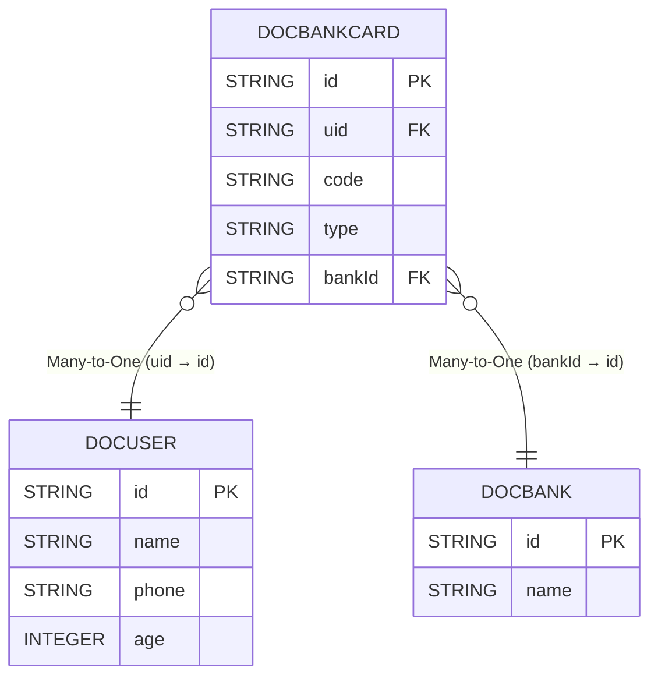

# 多表查询
`easy-query`提供了丰富的多表链接查询,并且支持匿名表链接查询除了类sql的显式手动`join`外还支持隐式`join`

## api
`隐式join`没有`显式join`那样需要自己定义on,而是再表模型创建的时候定义好对应的关系,任意两张或多张表只要不是孤单表那么一定存在某种关系,当然这种关系大部分时候是可以通过表之间的列来确认,
还有一部分关系无法通过表模型来确定(动态的),对于无法确定关系的表我们使用`显式join`可以很好地解决,对于确定关系的模型我们更加应该使用`隐式join`来进行业务操作




::: tabs

@tab DocBankCard
```java

@Table("doc_bank_card")
@EntityProxy
@Data
@FieldNameConstants
@EasyAlias("bank_card")
public class DocBankCard implements ProxyEntityAvailable<DocBankCard, DocBankCardProxy> {
    @Column(primaryKey = true)
    private String id;
    private String uid;
    /**
     * 银行卡号
     */
    private String code;
    /**
     * 银行卡类型借记卡 储蓄卡
     */
    private String type;
    /**
     * 所属银行
     */
    private String bankId;

    @Navigate(value = RelationTypeEnum.ManyToOne, selfProperty = Fields.uid, targetProperty=DocUser.Fields.id)
    private DocUser user;


    @Navigate(value = RelationTypeEnum.ManyToOne, selfProperty = Fields.bankId, targetProperty=DocBank.Fields.id)
    private DocBank bank;
}

```

@tab DocUser
```java

@Table("doc_user")
@EntityProxy
@Data
@FieldNameConstants
@EasyAlias("user")
public class DocUser implements ProxyEntityAvailable<DocUser , DocUserProxy> {
    @Column(primaryKey = true)
    private String id;
    private String name;
    private String phone;
    private Integer age;

    @Navigate(value = RelationTypeEnum.OneToMany, selfProperty = Fields.id,,targetProperty = DocBankCard.Fields.uid)
    private List<DocBankCard> bankCards;
}
```
@tab DocBank
```java

@Table("doc_bank")
@EntityProxy
@Data
@FieldNameConstants
@EasyAlias("bank")
public class DocBank implements ProxyEntityAvailable<DocBank, DocBankProxy> {
    @Column(primaryKey = true)
    private String id;
    private String name;

    @Navigate(value = RelationTypeEnum.OneToMany, selfProperty = Fields.id,, targetProperty = DocBankCard.Fields.bankId)
    private List<DocBankCard> bankCards;
}
```

:::

## 查询银行卡

条件是用户名叫做小明的银行卡全部查出来
```java

List<DocBankCard> xmCards = easyEntityQuery.queryable(DocBankCard.class)
        .where(bank_card -> {
            bank_card.user().name().eq("小明");
        })
        .toList();


==> Preparing: SELECT t.id,t.uid,t.code,t.type,t.bank_id FROM doc_bank_card t LEFT JOIN doc_user t1 ON t1.id = t.uid WHERE t1.name = ?
==> Parameters: 小明(String)
```

## 动态join
查询银行卡条件可以传入持卡人姓名或者不传入来筛选结果

以下查询支持动态join,有查询条件那么会自动join用户表否则不会进行join真正做到了`智能orm`
```java

String queryName=null;
List<DocBankCard> xmCards = easyEntityQuery.queryable(DocBankCard.class)
        //如果查询条件不符合那么将不会加入到条件中
        .filterConfigure(NotNullOrEmptyValueFilter.DEFAULT)
        .where(bank_card -> {
            bank_card.user().name().eq(queryName);
        })
        .toList();

==> Preparing: SELECT t.id,t.uid,t.code,t.type,t.bank_id FROM doc_bank_card t
```

## 查询返回卡号和姓名和所属银行名称
你只需要点点点即可将原先定义好的关系进行快速的筛选排序搜索返回分组等等一些列的操作
```java

List<Draft3<String, String, String>> result = easyEntityQuery.queryable(DocBankCard.class)
        .filterConfigure(NotNullOrEmptyValueFilter.DEFAULT)
        .where(bank_card -> {
            bank_card.user().name().eq("小明");
        })
        .select(bank_card -> Select.DRAFT.of(
                bank_card.code(),
                bank_card.user().name(),//自动join用户表
                bank_card.bank().name()//自动join银行表
        )).toList();


==> Preparing: SELECT t.code AS value1,t1.name AS value2,t2.name AS value3 FROM doc_bank_card t LEFT JOIN doc_user t1 ON t1.id = t.uid LEFT JOIN doc_bank t2 ON t2.id = t.bank_id WHERE t1.name = ?
==> Parameters: 小明(String)
```


## 最强多表
`eq`不单单支持`显式join`,还支持`隐式join`并且最最最重要的是支持`显式+隐式混合使用`这是其他orm做不到的
```java


List<Draft3<String, String, String>> result = easyEntityQuery.queryable(DocBankCard.class)
        .filterConfigure(NotNullOrEmptyValueFilter.DEFAULT)
        .leftJoin(DocBank.class,(bank_card, bank) -> bank_card.bankId().eq(bank.id()))
        .where((bank_card, bank) -> {
            bank_card.user().name().eq("小明");
        })
        .select((bank_card, bank) -> Select.DRAFT.of(
                bank_card.code(),
                bank_card.user().name(),
                bank.name()
        )).toList();


==> Preparing: SELECT t.code AS value1,t2.name AS value2,t1.name AS value3 FROM doc_bank_card t LEFT JOIN doc_bank t1 ON t.bank_id = t1.id LEFT JOIN doc_user t2 ON t2.id = t.uid WHERE t2.name = ?
==> Parameters: 小明(String)
```