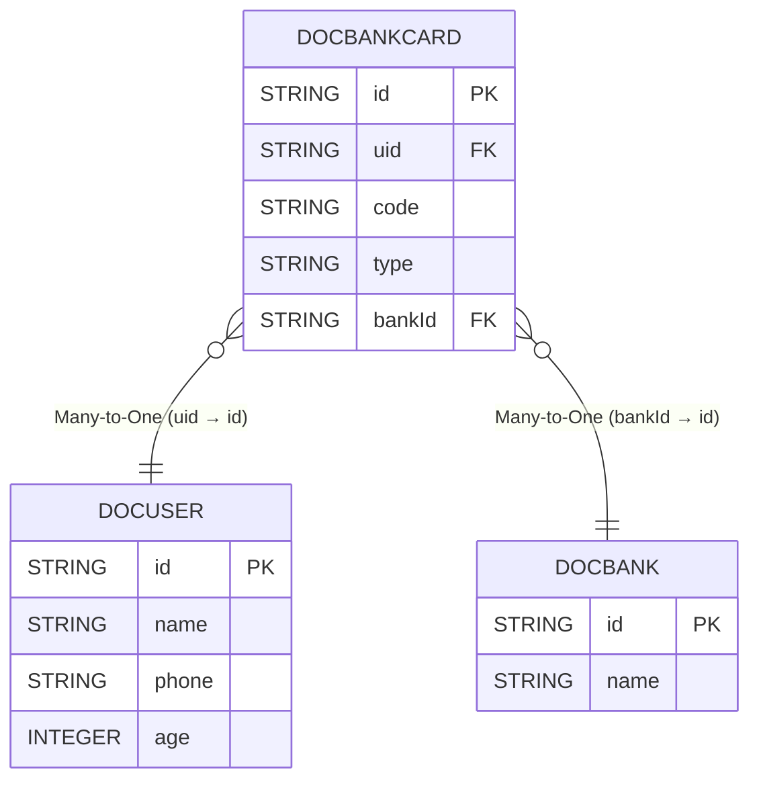

# 多表join

# 隐式join
使用对象关系进行join查询,可以很轻松的实现`动态join`


## api
`隐式join`没有`显式join`那样需要自己定义on,而是再表模型创建的时候定义好对应的关系,任意两张或多张表只要不是孤单表那么一定存在某种关系,当然这种关系大部分时候是可以通过表之间的列来确认,
还有一部分关系无法通过表模型来确定(动态的),对于无法确定关系的表我们使用`显式join`可以很好地解决,对于确定关系的模型我们更加应该使用`隐式join`来进行业务操作




::: tabs

@tab DocBankCard
```java

@Table("doc_bank_card")
@EntityProxy
@Data
@FieldNameConstants
@EasyAlias("bank_card")
public class DocBankCard implements ProxyEntityAvailable<DocBankCard, DocBankCardProxy> {
    @Column(primaryKey = true)
    private String id;
    private String uid;
    /**
     * 银行卡号
     */
    private String code;
    /**
     * 银行卡类型借记卡 储蓄卡
     */
    private String type;
    /**
     * 所属银行
     */
    private String bankId;

    @Navigate(value = RelationTypeEnum.ManyToOne, selfProperty = Fields.uid, targetProperty=DocUser.Fields.id)
    private DocUser user;


    @Navigate(value = RelationTypeEnum.ManyToOne, selfProperty = Fields.bankId, targetProperty=DocBank.Fields.id)
    private DocBank bank;
}

```

@tab DocUser
```java

@Table("doc_user")
@EntityProxy
@Data
@FieldNameConstants
@EasyAlias("user")
public class DocUser implements ProxyEntityAvailable<DocUser , DocUserProxy> {
    @Column(primaryKey = true)
    private String id;
    private String name;
    private String phone;
    private Integer age;

    @Navigate(value = RelationTypeEnum.OneToMany, selfProperty = Fields.id,,targetProperty = DocBankCard.Fields.uid)
    private List<DocBankCard> bankCards;
}
```
@tab DocBank
```java

@Table("doc_bank")
@EntityProxy
@Data
@FieldNameConstants
@EasyAlias("bank")
public class DocBank implements ProxyEntityAvailable<DocBank, DocBankProxy> {
    @Column(primaryKey = true)
    private String id;
    private String name;

    @Navigate(value = RelationTypeEnum.OneToMany, selfProperty = Fields.id,, targetProperty = DocBankCard.Fields.bankId)
    private List<DocBankCard> bankCards;
}
```

:::

## 查询银行卡

条件是用户名叫做小明的银行卡全部查出来
```java

List<DocBankCard> xmCards = easyEntityQuery.queryable(DocBankCard.class)
        .where(bank_card -> {
            bank_card.user().name().eq("小明");
        })
        .toList();


==> Preparing: SELECT t.id,t.uid,t.code,t.type,t.bank_id FROM doc_bank_card t LEFT JOIN doc_user t1 ON t1.id = t.uid WHERE t1.name = ?
==> Parameters: 小明(String)
```

## 动态join
查询银行卡条件可以传入持卡人姓名或者不传入来筛选结果

以下查询支持动态join,有查询条件那么会自动join用户表否则不会进行join真正做到了`智能orm`
```java

String queryName=null;
List<DocBankCard> xmCards = easyEntityQuery.queryable(DocBankCard.class)
        //如果查询条件不符合那么将不会加入到条件中
        .filterConfigure(NotNullOrEmptyValueFilter.DEFAULT)
        .where(bank_card -> {
            bank_card.user().name().eq(queryName);
        })
        .toList();

==> Preparing: SELECT t.id,t.uid,t.code,t.type,t.bank_id FROM doc_bank_card t
```

## 查询返回卡号和姓名和所属银行名称
你只需要点点点即可将原先定义好的关系进行快速的筛选排序搜索返回分组等等一些列的操作
```java

List<Draft3<String, String, String>> result = easyEntityQuery.queryable(DocBankCard.class)
        .filterConfigure(NotNullOrEmptyValueFilter.DEFAULT)
        .where(bank_card -> {
            bank_card.user().name().eq("小明");
        })
        .select(bank_card -> Select.DRAFT.of(
                bank_card.code(),
                bank_card.user().name(),//自动join用户表
                bank_card.bank().name()//自动join银行表
        )).toList();


==> Preparing: SELECT t.code AS value1,t1.name AS value2,t2.name AS value3 FROM doc_bank_card t LEFT JOIN doc_user t1 ON t1.id = t.uid LEFT JOIN doc_bank t2 ON t2.id = t.bank_id WHERE t1.name = ?
==> Parameters: 小明(String)
```


## 最强多表
`eq`不单单支持`显式join`,还支持`隐式join`并且最最最重要的是支持`显式+隐式混合使用`这是其他orm做不到的
```java


List<Draft3<String, String, String>> result = easyEntityQuery.queryable(DocBankCard.class)
        .filterConfigure(NotNullOrEmptyValueFilter.DEFAULT)
        .leftJoin(DocBank.class,(bank_card, bank) -> bank_card.bankId().eq(bank.id()))
        .where((bank_card, bank) -> {
            bank_card.user().name().eq("小明");
        })
        .select((bank_card, bank) -> Select.DRAFT.of(
                bank_card.code(),
                bank_card.user().name(),
                bank.name()
        )).toList();


==> Preparing: SELECT t.code AS value1,t2.name AS value2,t1.name AS value3 FROM doc_bank_card t LEFT JOIN doc_bank t1 ON t.bank_id = t1.id LEFT JOIN doc_user t2 ON t2.id = t.uid WHERE t2.name = ?
==> Parameters: 小明(String)
```

# 显式join
当隐式join无法满足时建议用户使用显式join,显式join和sql表达式基本一致


## api变化
当使用join操作后
- `where`存在两种重载,第一种就是单个参数,第二种是两个参数,单个参数为主表操作,两个参数为表顺序,`select`、`groupBy`.....同理

## leftJoin
```java
Topic topic = easyEntityQuery
                .queryable(Topic.class)
                .leftJoin(BlogEntity.class, (t, t1) -> t.id().eq(t1.id()))
                .where(o -> o.id().eq("3"))
                .firstOrNull();

==> Preparing: SELECT t.`id`,t.`stars`,t.`title`,t.`create_time` FROM t_topic t LEFT JOIN t_blog t1 ON t1.`deleted` = ? AND t.`id` = t1.`id` WHERE t.`id` = ? LIMIT 1
==> Parameters: false(Boolean),3(String)
<== Total: 1
```

## innerJoin
```java
 List<BlogEntity> blogEntities = easyEntityQuery
                .queryable(Topic.class)
                .innerJoin(BlogEntity.class, (t, t1) -> t.id().eq(t1.id()))
                .where((t, t1) ->{
                        t1.title().isNotNull();
                        t.id().eq("3");
                })
                .select((t, t1) -> t1)
                // .select(BlogEntity.class, (t, t1) -> t1.FETCHER.allFields())
                .toList();

==> Preparing: SELECT t1.`id`,t1.`create_time`,t1.`update_time`,t1.`create_by`,t1.`update_by`,t1.`deleted`,t1.`title`,t1.`content`,t1.`url`,t1.`star`,t1.`publish_time`,t1.`score`,t1.`status`,t1.`order`,t1.`is_top`,t1.`top` FROM t_topic t INNER JOIN t_blog t1 ON t1.`deleted` = ? AND t.`id` = t1.`id` WHERE t1.`title` IS NOT NULL AND t.`id` = ?
==> Parameters: false(Boolean),3(String)
<== Total: 1
```

## join的on多条件

```java
Topic topic = easyEntityQuery
        .queryable(Topic.class)
        .leftJoin(BlogEntity.class, (t, t1) ->{
            t.id().eq(t1.id());
            t1.title().like("234");
        })
        .where(o -> o.id().eq("3"))
        .singleOrNull();

==> Preparing: SELECT t.`id`,t.`stars`,t.`title`,t.`create_time` FROM `t_topic` t LEFT JOIN `t_blog` t1 ON t1.`deleted` = ? AND t.`id` = t1.`id` AND t1.`title` LIKE ? WHERE t.`id` = ?
==> Parameters: false(Boolean),%234%(String),3(String)
```


## 查询返回两个表的部分字段
```java
//定义一个返回结果vo

@Data
@EntityProxy
public class TopicAndBlogVO {
    private String column1;
    private String column2;
}


List<TopicAndBlogVO> list1 = easyEntityQuery.queryable(BlogEntity.class)
        .leftJoin(Topic.class, (t_blog, t_topic) -> t_blog.id().eq(t_topic.id()))
        .select((t_blog, t_topic) -> new TopicAndBlogVOProxy()
                .column1().set(t_blog.title()) //列1
                .column2().set(t_topic.title()) //列2
        )
        .toList();


-- 第1条sql数据
SELECT
    t.`title` AS `column1`,
    t1.`title` AS `column2` 
FROM
    `t_blog` t 
LEFT JOIN
    `t_topic` t1 
        ON t.`id` = t1.`id` 
WHERE
    t.`deleted` = false
```

## 嵌套Join
```java
 
EntityQueryable<TopicProxy, Topic> sql = easyEntityQuery
        .queryable(Topic.class)
        .where(o -> o.id().eq("3"));

List<BlogEntity> list = easyEntityQuery.queryable(BlogEntity.class)
        .leftJoin(sql, (t_blog, t2) -> t_blog.id().eq(t2.id()))
        .where((t_blog, t_topic) -> {
            t_blog.id().eq("345");
            t_topic.id().eq("789");
        }).toList();


-- 第1条sql数据
SELECT
    t.`id`,
    t.`create_time`,
    t.`update_time`,
    t.`create_by`,
    t.`update_by`,
    t.`deleted`,
    t.`title`,
    t.`content`,
    t.`url`,
    t.`star`,
    t.`publish_time`,
    t.`score`,
    t.`status`,
    t.`order`,
    t.`is_top`,
    t.`top` 
FROM
    `t_blog` t 
LEFT JOIN
    (
        SELECT
            t1.`id`,
            t1.`stars`,
            t1.`title`,
            t1.`create_time` 
        FROM
            `t_topic` t1 
        WHERE
            t1.`id` = '3'
    ) t2 
        ON t.`id` = t2.`id` 
WHERE
    t.`deleted` = false 
    AND t.`id` = '345' 
    AND t2.`id` = '789'
```

## group join

```java

EntityQueryable<TopicGroupTestDTOProxy, TopicGroupTestDTO> sql = easyEntityQuery
        .queryable(Topic.class)
        .where(o -> o.id().eq("3"))
        .groupBy(o -> GroupKeys.of(o.id()))
        .select(group -> new TopicGroupTestDTOProxy()
                .id().set(group.key1()) //
                .idCount().set(group.groupTable().id().intCount()));

List<Draft2<String, Integer>> list = easyEntityQuery.queryable(BlogEntity.class)
        .leftJoin(sql, (a, b) -> a.id().eq(b.id()))
        .where((b1, t2) -> {
            b1.id().isNotNull();
            t2.id().eq("123");
        }).select((b1, t2) -> Select.DRAFT.of(
                b1.id(),
                t2.idCount()
        )).toList();


SELECT
    t.`id` AS `value1`,
    t3.`id_count` AS `value2` 
FROM
    `t_blog` t 
LEFT JOIN
    (
        SELECT
            t1.`id` AS `id`,
            COUNT(t1.`id`) AS `id_count` 
        FROM
            `t_topic` t1 
        WHERE
            t1.`id` = '3' 
        GROUP BY
            t1.`id`
    ) t3 
        ON t.`id` = t3.`id` 
WHERE
    t.`deleted` = false 
    AND t.`id` IS NOT NULL 
    AND t3.`id` = '123'

```

## 公共表达式
```java

EntityQueryable<TopicGroupTestDTOProxy, TopicGroupTestDTO> sql = easyEntityQuery
        .queryable(Topic.class)
        .where(o -> o.id().eq("3"))
        .groupBy(o -> GroupKeys.of(o.id()))
        .select(group -> new TopicGroupTestDTOProxy()
                .id().set(group.key1()) //
                .idCount().set(group.groupTable().id().intCount()))
        .toCteAs();

List<Draft2<String, Integer>> list = easyEntityQuery.queryable(BlogEntity.class)
        .leftJoin(sql, (a, b) -> a.id().eq(b.id()))
        .where((b1, t2) -> {
            b1.id().isNotNull();
            t2.id().eq("123");
        }).select((b1, t2) -> Select.DRAFT.of(
                b1.id(),
                t2.idCount()
        )).toList();


WITH `with_TopicGroupTestDTO` AS (SELECT
    t1.`id` AS `id`,
    COUNT(t1.`id`) AS `id_count` 
FROM
    `t_topic` t1 
WHERE
    t1.`id` = '3' 
GROUP BY
    t1.`id`)  

SELECT
    t.`id` AS `value1`,
    t3.`id_count` AS `value2` 
FROM
    `t_blog` t 
LEFT JOIN
    `with_TopicGroupTestDTO` t3 
        ON t.`id` = t3.`id` 
WHERE
    t.`deleted` = false 
    AND t.`id` IS NOT NULL 
    AND t3.`id` = '123'
```

## join2表以上


```java
//返回Queryable3那么可以对这个查询表达式进行后续操作,操作都是可以操作三张表的
easyEntitQuery.queryable(Topic.class)
        //第一个join采用双参数,参数1表示第一张表Topic 参数2表示第二张表 BlogEntity,对应关系就是参数顺序
        .leftJoin(BlogEntity.class, (t, t1) -> t.id().eq(t1.id()))//t表示Topic表,t1表示BlogEntity表,对应关系就是参数顺序
        //第二个join采用三参数,参数1表示第一张表Topic 参数2表示第二张表 BlogEntity 第三个参数表示第三张表 SysUser,对应关系就是参数顺序
        .leftJoin(SysUser.class, (t, t1, t2) -> t.id().eq(t2.id()))
        .where(o -> o.id().eq("123"))//单个条件where参数为主表Topic
        //支持单个参数或者全参数,全参数个数为主表+join表个数 链式写法期间可以通过then来切换操作表
        .where((t, t1, t2) -> {
                t.id().eq("123");
                t1.title().like("456");
                t2.createTime().eq(LocalDateTime.now());
        });


//也支持单表的Queryable返回,但是这样后续操作只可以操作单表没办法操作其他join表了
easyEntitQuery.queryable(Topic.class)
        //第一个join采用双参数,参数1表示第一张表Topic 参数2表示第二张表 BlogEntity
        .leftJoin(BlogEntity.class, (t, t1) -> t.id().eq(t1.id()))
        //第二个join采用三参数,参数1表示第一张表Topic 参数2表示第二张表 BlogEntity 第三个参数表示第三张表 SysUser
        .leftJoin(SysUser.class, (t, t1, t2) -> t.id().eq(t2.id()))
        .where(o -> o.id().eq("123"))//单个条件where参数为主表Topic
        //支持单个参数或者全参数,全参数个数为主表+join表个数 链式写法期间可以通过then来切换操作表
        //如果where参数过多不想写可以用whereMerge,selectMerge,orderByMerge同理
        .where((t, t1, t2) -> {
                t.id().eq("123");
                t1.title().like("456");
                t2.createTime().eq(LocalDateTime.now());
        });
```

## 查询某一张表的所有字段
```java

List<Map<String, Object>> list1 = easyEntityQuery.queryable(BlogEntity.class)
        .leftJoin(Topic.class, (b, t2) -> b.id().eq(t2.id()))
        .select((b1, t2) -> {
                MapProxy result = new MapProxy();
                result.selectAll(b1);
                result.put("xx",t2.createTime());
                return result;
        })
        .toList();

==> Preparing: SELECT t.`id`,t.`create_time`,t.`update_time`,t.`create_by`,t.`update_by`,t.`deleted`,t.`title`,t.`content`,t.`url`,t.`star`,t.`publish_time`,t.`score`,t.`status`,t.`order`,t.`is_top`,t.`top`,t1.`create_time` AS `xx` FROM `t_blog` t LEFT JOIN `t_topic` t1 ON t.`id` = t1.`id` WHERE t.`deleted` = ?
==> Parameters: false(Boolean)
<== Time Elapsed: 6(ms)
<== Total: 100
```

## 查询所有字段忽略其中一个
```java
List<Map<String, Object>> list1 = easyEntityQuery.queryable(BlogEntity.class)
        .leftJoin(Topic.class, (b, t2) -> b.id().eq(t2.id()))
        .select((b1, t2) -> {
            MapProxy result = new MapProxy();
            result.selectAll(b1);
            result.selectIgnores(b1.createTime());
            result.put("xx",t2.createTime());
            return result;
        })
        .toList();

==> Preparing: SELECT t.`id`,t.`update_time`,t.`create_by`,t.`update_by`,t.`deleted`,t.`title`,t.`content`,t.`url`,t.`star`,t.`publish_time`,t.`score`,t.`status`,t.`order`,t.`is_top`,t.`top`,t1.`create_time` AS `xx` FROM `t_blog` t LEFT JOIN `t_topic` t1 ON t.`id` = t1.`id` WHERE t.`deleted` = ?
==> Parameters: false(Boolean)
```
