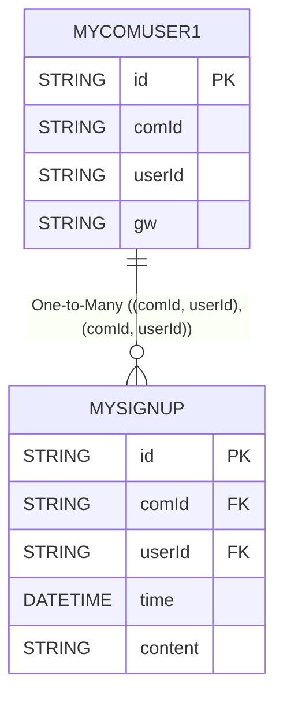

# 说明
`selectAutoInclude`在处理大部分业务的时候已经足够优秀便捷了,但是在部分特定场合需要动态处理某些子项自定义的时候还是会出现繁琐的情况(你可以通过显式include()来做到,但是如果我只是希望其中某一层级需要就需要把所有层级都进行显式描述)这样实在是太麻烦了,所以在后续版本`eq`推出了`SelectAutoIncludeConfigurable`接口和`EntitySelectAutoIncludeConfigurable`来快速帮用户实现需求


## SelectAutoIncludeConfigurable
方法  | 描述
--- | --- 
`isInheritedBehavior`  | 是否继承`实体|dto`的`order+limit+offset`行为
`configure` | 自行配置当前结构化对象节点的查询sql

## EntitySelectAutoIncludeConfigurable
方法  | 描述
--- | --- 
`isInheritedBehavior`  | 是否继承`实体|dto`的`order+limit+offset`行为
`configure` | 自行配置当前结构化对象节点的查询sql
`entityConfigure` | 自行配置当前结构化对象节点的查询sql,将`configure`进行强类型化


::: tabs

@tab 关系图

@tab MyComUser1
```java

@Data
@Table("my_com_user")
@EntityProxy
public class MyComUser1 implements ProxyEntityAvailable<MyComUser1, MyComUser1Proxy> {
    @Column(primaryKey = true)
    private String id;
    private String comId;
    private String userId;
    private String gw;

    @Navigate(value = RelationTypeEnum.OneToMany, selfProperty = {"comId", "userId"}, targetProperty = {"comId", "userId"}, orderByProps = {
            @OrderByProperty(property = "comId"),
            @OrderByProperty(property = "time", asc = false, mode = OrderByPropertyModeEnum.NULLS_FIRST),
    })
    private List<MySignUp> mySignUps;
}
```
@tab MySignUp
```java
@Data
@Table("my_sign_up")
@EntityProxy
@FieldNameConstants
public class MySignUp implements ProxyEntityAvailable<MySignUp, MySignUpProxy> {
    @Column(primaryKey = true)
    private String id;
    private String comId;
    private String userId;
    private LocalDateTime time;
    private String content;
    @Navigate(value = RelationTypeEnum.ManyToOne, selfProperty = {"comId", "userId"}, targetProperty = {"comId", "userId"})
    private MyComUser comUser;
}
```

:::

## 实体行为
实体行为是实体对象的@Navigate上面的`order、limit、offset`如果dto设置了`order`采用dto的否则使用实体对象的,如果dto使用了`limit+offset`则用dto的否则使用实体对象的,
如果接口`isInheritedBehavior`方法返回false则会忽略上述实体行为自行控制


## 不继承实体对象行为dto自己排序
```java

@Data
public class MyComUserDTO8 {


    private String gw;
    //dto显式指定了order那么会覆盖掉entity的
    @Navigate(value = RelationTypeEnum.OneToMany, orderByProps = {
            @OrderByProperty(property = "comId"),
            @OrderByProperty(property = "time", asc = false, mode = OrderByPropertyModeEnum.NULLS_LAST),
    })
    private List<InternalMySignUps> mySignUps;


    /**
     * {@link com.easy.query.test.doc.MySignUp }
     */
    @Data
    @FieldNameConstants
    public static class InternalMySignUps implements SelectAutoIncludeConfigurable {
        private String id;
        private LocalDateTime time;
        private String content;

//接口优先级最高 false表示不继承实体对象行为,那么由接口方法configure来设置,也会忽略掉dto上的配置
        @Override
        public boolean isInheritedBehavior() {
            return false;//false表示不继承对象行为
        }

        @Override
        public <T> ClientQueryable<T> configure(ClientQueryable<T> queryable, ConfigureArgument configureArgument) {
            return queryable.where(o->o.eq(Fields.time,"123123"))
                    .orderByAsc(o->o.column(Fields.time));
        }
    }
}


List<MyComUserDTO8> list = easyEntityQuery.queryable(MyComUser1.class)
                    .selectAutoInclude(MyComUserDTO8.class)
                    .toList();


==> Preparing: SELECT t.`gw`,t.`com_id` AS `__relation__comId`,t.`user_id` AS `__relation__userId` FROM `my_com_user` t
<== Time Elapsed: 1(ms)
<== Total: 4
==> Preparing: SELECT t.`id`,t.`time`,t.`content`,t.`com_id` AS `__relation__comId`,t.`user_id` AS `__relation__userId` FROM `my_sign_up` t WHERE t.`time` = ? AND ((t.`com_id` =? AND t.`user_id` =?) OR (t.`com_id` =? AND t.`user_id` =?) OR (t.`com_id` =? AND t.`user_id` =?) OR (t.`com_id` =? AND t.`user_id` =?)) ORDER BY t.`time` ASC
==> Parameters: 123123(String),c1(String),u1(String),c2(String),u1(String),c1(String),u2(String),c1(String),u3(String)
<== Time Elapsed: 2(ms)
<== Total: 0
```


## 不继承实体对象行为
```java

@Data
public class MyComUserDTO9 {


    private String gw;
    @Navigate(value = RelationTypeEnum.OneToMany)
    private List<InternalMySignUps> mySignUps;


    /**
     * {@link com.easy.query.test.doc.MySignUp }
     */
    @Data
    @FieldNameConstants
    public static class InternalMySignUps implements SelectAutoIncludeConfigurable {
        private String id;
        private LocalDateTime time;
        private String content;


        @Override
        public boolean isInheritedBehavior() {
            return false;
        }

        @Override
        public <T> ClientQueryable<T> configure(ClientQueryable<T> queryable, ConfigureArgument configureArgument) {
            Map<String, String> map = configureArgument.getTypeArg();//外部传递的参数支持任意类型
            return queryable.where(o -> {
                for (Map.Entry<String, String> stringStringEntry : map.entrySet()) {
                    String column = stringStringEntry.getKey();
                    String value = stringStringEntry.getValue();
                    o.eq(column, value);
                }
            });
        }
    }


}


HashMap<String, String> props = new HashMap<>();
props.put("time", "123123");
props.put("id", "456");

List<MyComUserDTO9> list = easyEntityQuery.queryable(MyComUser1.class)
        .configure(o -> {
            o.setConfigureArgument(props);//传递的参数支持任意类型
        })
        .selectAutoInclude(MyComUserDTO9.class)
        .toList();


==> Preparing: SELECT t.`gw`,t.`com_id` AS `__relation__comId`,t.`user_id` AS `__relation__userId` FROM `my_com_user` t
<== Time Elapsed: 14(ms)
<== Total: 4
==> Preparing: SELECT t.`id`,t.`time`,t.`content`,t.`com_id` AS `__relation__comId`,t.`user_id` AS `__relation__userId` FROM `my_sign_up` t WHERE t.`time` = ? AND t.`id` = ? AND ((t.`com_id` =? AND t.`user_id` =?) OR (t.`com_id` =? AND t.`user_id` =?) OR (t.`com_id` =? AND t.`user_id` =?) OR (t.`com_id` =? AND t.`user_id` =?))
==> Parameters: 123123(String),456(String),c1(String),u1(String),c2(String),u1(String),c1(String),u2(String),c1(String),u3(String)
<== Time Elapsed: 6(ms)
<== Total: 0
```


## entity模式
不继承实体对象行为`orderBy`自行控制
```java

@Data
public class MyComUserDTO10 {


    private String gw;
    @Navigate(value = RelationTypeEnum.OneToMany)
    private List<InternalMySignUps> mySignUps;


    /**
     * {@link MySignUp }
     */
    @Data
    @FieldNameConstants
    public static class InternalMySignUps implements EntitySelectAutoIncludeConfigurable<MySignUp, MySignUpProxy> {
        private String id;
        private LocalDateTime time;
        private String content;


        @Override
        public boolean isInheritedBehavior() {
            return false;
        }

        @Override
        public EntityQueryable<MySignUpProxy, MySignUp> entityConfigure(EntityQueryable<MySignUpProxy, MySignUp> queryable, ConfigureArgument configureArgument) {
            return queryable.where(o->{
                o.userId().eq("12345");
            }).orderBy(m -> m.content().asc());
        }
    }


}


HashMap<String, String> props = new HashMap<>();
props.put("time", "123123");
props.put("id", "456");


List<MyComUserDTO10> list = easyEntityQuery.queryable(MyComUser1.class)
        .configure(o -> {
            o.setConfigureArgument(props);
        })
        .selectAutoInclude(MyComUserDTO10.class)
        .toList();


==> Preparing: SELECT t.`gw`,t.`com_id` AS `__relation__comId`,t.`user_id` AS `__relation__userId` FROM `my_com_user` t
<== Time Elapsed: 15(ms)
<== Total: 4
==> Preparing: SELECT t.`id`,t.`time`,t.`content`,t.`com_id` AS `__relation__comId`,t.`user_id` AS `__relation__userId` FROM `my_sign_up` t WHERE t.`user_id` = ? AND ((t.`com_id` =? AND t.`user_id` =?) OR (t.`com_id` =? AND t.`user_id` =?) OR (t.`com_id` =? AND t.`user_id` =?) OR (t.`com_id` =? AND t.`user_id` =?)) ORDER BY t.`content` ASC
==> Parameters: 12345(String),c1(String),u1(String),c2(String),u1(String),c1(String),u2(String),c1(String),u3(String)
<== Time Elapsed: 10(ms)
<== Total: 0
```

## 继承entity行为
承实体对象行为
```java

@Data
public class MyComUserDTO11 {


    private String gw;
    @Navigate(value = RelationTypeEnum.OneToMany)
    private List<InternalMySignUps> mySignUps;


    /**
     * {@link MySignUp }
     */
    @Data
    @FieldNameConstants
    public static class InternalMySignUps implements EntitySelectAutoIncludeConfigurable<MySignUp, MySignUpProxy> {
        private String id;
        private LocalDateTime time;
        private String content;


        @Override
        public boolean isInheritedBehavior() {
            return true;
        }


        @Override
        public EntityQueryable<MySignUpProxy, MySignUp> entityConfigure(EntityQueryable<MySignUpProxy, MySignUp> queryable, ConfigureArgument configureArgument) {
            return queryable.where(o->{
                o.userId().eq("12345");
            });
        }
    }


}
HashMap<String, String> props = new HashMap<>();
props.put("time", "123123");
props.put("id", "456");


List<MyComUserDTO11> list = easyEntityQuery.queryable(MyComUser1.class)
        .configure(o -> {
            o.setConfigureArgument(props);
        })
        .selectAutoInclude(MyComUserDTO11.class)
        .toList();


==> Preparing: SELECT t.`gw`,t.`com_id` AS `__relation__comId`,t.`user_id` AS `__relation__userId` FROM `my_com_user` t
<== Time Elapsed: 23(ms)
<== Total: 4
==> Preparing: SELECT t.`id`,t.`time`,t.`content`,t.`com_id` AS `__relation__comId`,t.`user_id` AS `__relation__userId` FROM `my_sign_up` t WHERE t.`user_id` = ? AND ((t.`com_id` =? AND t.`user_id` =?) OR (t.`com_id` =? AND t.`user_id` =?) OR (t.`com_id` =? AND t.`user_id` =?) OR (t.`com_id` =? AND t.`user_id` =?)) ORDER BY t.`com_id` ASC,CASE WHEN t.`time` IS NULL THEN 0 ELSE 1 END ASC,t.`time` DESC
==> Parameters: 12345(String),c1(String),u1(String),c2(String),u1(String),c1(String),u2(String),c1(String),u3(String)
<== Time Elapsed: 4(ms)
<== Total: 0
```