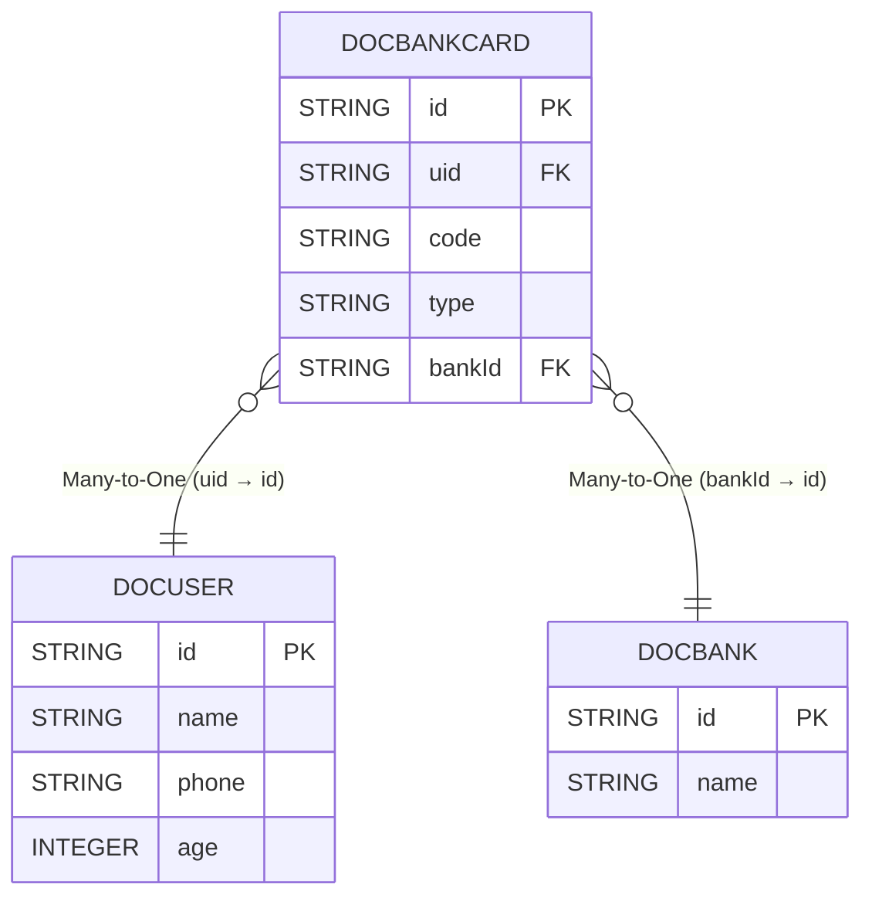

# Multi-Table Join

# Implicit Join
Use object relationships for join queries, easily implementing `dynamic join`.

## API
`Implicit join` doesn't require defining the on clause like `explicit join`. Instead, the relationships are defined when creating the table model. Any two or more tables, as long as they're not isolated tables, must have some relationship. Most of the time, this relationship can be determined through columns between tables. For relationships that cannot be determined through the table model (dynamic ones), we use `explicit join` to solve them well. For models with determined relationships, we should use `implicit join` for business operations.



::: tabs

@tab DocBankCard
```java

@Table("doc_bank_card")
@EntityProxy
@Data
@FieldNameConstants
@EasyAlias("bank_card")
public class DocBankCard implements ProxyEntityAvailable<DocBankCard, DocBankCardProxy> {
    @Column(primaryKey = true)
    private String id;
    private String uid;
    /**
     * Bank card number
     */
    private String code;
    /**
     * Bank card type: debit card, savings card
     */
    private String type;
    /**
     * Belongs to bank
     */
    private String bankId;

    @Navigate(value = RelationTypeEnum.ManyToOne, selfProperty = Fields.uid, targetProperty=DocUser.Fields.id)
    private DocUser user;


    @Navigate(value = RelationTypeEnum.ManyToOne, selfProperty = Fields.bankId, targetProperty=DocBank.Fields.id)
    private DocBank bank;
}

```

@tab DocUser
```java

@Table("doc_user")
@EntityProxy
@Data
@FieldNameConstants
@EasyAlias("user")
public class DocUser implements ProxyEntityAvailable<DocUser , DocUserProxy> {
    @Column(primaryKey = true)
    private String id;
    private String name;
    private String phone;
    private Integer age;

    @Navigate(value = RelationTypeEnum.OneToMany, selfProperty = Fields.id, targetProperty = DocBankCard.Fields.uid)
    private List<DocBankCard> bankCards;
}
```
@tab DocBank
```java

@Table("doc_bank")
@EntityProxy
@Data
@FieldNameConstants
@EasyAlias("bank")
public class DocBank implements ProxyEntityAvailable<DocBank, DocBankProxy> {
    @Column(primaryKey = true)
    private String id;
    private String name;

    @Navigate(value = RelationTypeEnum.OneToMany, selfProperty = Fields.id, targetProperty = DocBankCard.Fields.bankId)
    private List<DocBankCard> bankCards;
}
```

:::

## Query Bank Cards

Query all bank cards where the user's name is XiaoMing:
```java

List<DocBankCard> xmCards = easyEntityQuery.queryable(DocBankCard.class)
        .where(bank_card -> {
            bank_card.user().name().eq("XiaoMing");
        })
        .toList();


==> Preparing: SELECT t.id,t.uid,t.code,t.type,t.bank_id FROM doc_bank_card t LEFT JOIN doc_user t1 ON t1.id = t.uid WHERE t1.name = ?
==> Parameters: XiaoMing(String)
```

## Dynamic Join
Query bank cards with optional filtering by cardholder name:

The following query supports dynamic join. If there's a query condition, it will automatically join the user table; otherwise, no join occurs, truly achieving `intelligent ORM`:
```java

String queryName=null;
List<DocBankCard> xmCards = easyEntityQuery.queryable(DocBankCard.class)
        //If query condition doesn't match, it won't be added to the condition
        .filterConfigure(NotNullOrEmptyValueFilter.DEFAULT)
        .where(bank_card -> {
            bank_card.user().name().eq(queryName);
        })
        .toList();

==> Preparing: SELECT t.id,t.uid,t.code,t.type,t.bank_id FROM doc_bank_card t
```

## Query Card Number, Name, and Bank Name
You just need to point and click to quickly filter, sort, search, return, group, etc., using the predefined relationships:
```java

List<Draft3<String, String, String>> result = easyEntityQuery.queryable(DocBankCard.class)
        .filterConfigure(NotNullOrEmptyValueFilter.DEFAULT)
        .where(bank_card -> {
            bank_card.user().name().eq("XiaoMing");
        })
        .select(bank_card -> Select.DRAFT.of(
                bank_card.code(),
                bank_card.user().name(),//Auto-join user table
                bank_card.bank().name()//Auto-join bank table
        )).toList();


==> Preparing: SELECT t.code AS value1,t1.name AS value2,t2.name AS value3 FROM doc_bank_card t LEFT JOIN doc_user t1 ON t1.id = t.uid LEFT JOIN doc_bank t2 ON t2.id = t.bank_id WHERE t1.name = ?
==> Parameters: XiaoMing(String)
```

## Most Powerful Multi-Table
`eq` not only supports `explicit join` but also `implicit join`, and most importantly, supports `explicit + implicit mixed use`, which other ORMs cannot do:
```java


List<Draft3<String, String, String>> result = easyEntityQuery.queryable(DocBankCard.class)
        .filterConfigure(NotNullOrEmptyValueFilter.DEFAULT)
        .leftJoin(DocBank.class,(bank_card, bank) -> bank_card.bankId().eq(bank.id()))
        .where((bank_card, bank) -> {
            bank_card.user().name().eq("XiaoMing");
        })
        .select((bank_card, bank) -> Select.DRAFT.of(
                bank_card.code(),
                bank_card.user().name(),
                bank.name()
        )).toList();


==> Preparing: SELECT t.code AS value1,t2.name AS value2,t1.name AS value3 FROM doc_bank_card t LEFT JOIN doc_bank t1 ON t.bank_id = t1.id LEFT JOIN doc_user t2 ON t2.id = t.uid WHERE t2.name = ?
==> Parameters: XiaoMing(String)
```

# Explicit Join
Use explicit join when implicit join cannot meet requirements. Explicit join is basically consistent with SQL expressions.

## API Changes
After using join operations:
- `where` has two overloads: single parameter for main table operations, two parameters for table order. Same for `select`, `groupBy`, etc.

## leftJoin
```java
Topic topic = easyEntityQuery
                .queryable(Topic.class)
                .leftJoin(BlogEntity.class, (t, t1) -> t.id().eq(t1.id()))
                .where(o -> o.id().eq("3"))
                .firstOrNull();

==> Preparing: SELECT t.`id`,t.`stars`,t.`title`,t.`create_time` FROM t_topic t LEFT JOIN t_blog t1 ON t1.`deleted` = ? AND t.`id` = t1.`id` WHERE t.`id` = ? LIMIT 1
==> Parameters: false(Boolean),3(String)
<== Total: 1
```

## innerJoin
```java
 List<BlogEntity> blogEntities = easyEntityQuery
                .queryable(Topic.class)
                .innerJoin(BlogEntity.class, (t, t1) -> t.id().eq(t1.id()))
                .where((t, t1) ->{
                        t1.title().isNotNull();
                        t.id().eq("3");
                })
                .select((t, t1) -> t1)
                // .select(BlogEntity.class, (t, t1) -> t1.FETCHER.allFields())
                .toList();

==> Preparing: SELECT t1.`id`,t1.`create_time`,t1.`update_time`,t1.`create_by`,t1.`update_by`,t1.`deleted`,t1.`title`,t1.`content`,t1.`url`,t1.`star`,t1.`publish_time`,t1.`score`,t1.`status`,t1.`order`,t1.`is_top`,t1.`top` FROM t_topic t INNER JOIN t_blog t1 ON t1.`deleted` = ? AND t.`id` = t1.`id` WHERE t1.`title` IS NOT NULL AND t.`id` = ?
==> Parameters: false(Boolean),3(String)
<== Total: 1
```

## Join On Multiple Conditions

```java
Topic topic = easyEntityQuery
        .queryable(Topic.class)
        .leftJoin(BlogEntity.class, (t, t1) ->{
            t.id().eq(t1.id());
            t1.title().like("234");
        })
        .where(o -> o.id().eq("3"))
        .singleOrNull();

==> Preparing: SELECT t.`id`,t.`stars`,t.`title`,t.`create_time` FROM `t_topic` t LEFT JOIN `t_blog` t1 ON t1.`deleted` = ? AND t.`id` = t1.`id` AND t1.`title` LIKE ? WHERE t.`id` = ?
==> Parameters: false(Boolean),%234%(String),3(String)
```

## Query Partial Fields From Two Tables
```java
//Define return result VO

@Data
@EntityProxy
public class TopicAndBlogVO {
    private String column1;
    private String column2;
}


List<TopicAndBlogVO> list1 = easyEntityQuery.queryable(BlogEntity.class)
        .leftJoin(Topic.class, (t_blog, t_topic) -> t_blog.id().eq(t_topic.id()))
        .select((t_blog, t_topic) -> new TopicAndBlogVOProxy()
                .column1().set(t_blog.title()) //Column 1
                .column2().set(t_topic.title()) //Column 2
        )
        .toList();


-- SQL 1
SELECT
    t.`title` AS `column1`,
    t1.`title` AS `column2` 
FROM
    `t_blog` t 
LEFT JOIN
    `t_topic` t1 
        ON t.`id` = t1.`id` 
WHERE
    t.`deleted` = false
```

## Nested Join
```java
 
EntityQueryable<TopicProxy, Topic> sql = easyEntityQuery
        .queryable(Topic.class)
        .where(o -> o.id().eq("3"));

List<BlogEntity> list = easyEntityQuery.queryable(BlogEntity.class)
        .leftJoin(sql, (t_blog, t2) -> t_blog.id().eq(t2.id()))
        .where((t_blog, t_topic) -> {
            t_blog.id().eq("345");
            t_topic.id().eq("789");
        }).toList();


-- SQL 1
SELECT
    t.`id`,
    t.`create_time`,
    t.`update_time`,
    t.`create_by`,
    t.`update_by`,
    t.`deleted`,
    t.`title`,
    t.`content`,
    t.`url`,
    t.`star`,
    t.`publish_time`,
    t.`score`,
    t.`status`,
    t.`order`,
    t.`is_top`,
    t.`top` 
FROM
    `t_blog` t 
LEFT JOIN
    (
        SELECT
            t1.`id`,
            t1.`stars`,
            t1.`title`,
            t1.`create_time` 
        FROM
            `t_topic` t1 
        WHERE
            t1.`id` = '3'
    ) t2 
        ON t.`id` = t2.`id` 
WHERE
    t.`deleted` = false 
    AND t.`id` = '345' 
    AND t2.`id` = '789'
```

## Group Join

```java

EntityQueryable<TopicGroupTestDTOProxy, TopicGroupTestDTO> sql = easyEntityQuery
        .queryable(Topic.class)
        .where(o -> o.id().eq("3"))
        .groupBy(o -> GroupKeys.of(o.id()))
        .select(group -> new TopicGroupTestDTOProxy()
                .id().set(group.key1()) //
                .idCount().set(group.groupTable().id().intCount()));

List<Draft2<String, Integer>> list = easyEntityQuery.queryable(BlogEntity.class)
        .leftJoin(sql, (a, b) -> a.id().eq(b.id()))
        .where((b1, t2) -> {
            b1.id().isNotNull();
            t2.id().eq("123");
        }).select((b1, t2) -> Select.DRAFT.of(
                b1.id(),
                t2.idCount()
        )).toList();


SELECT
    t.`id` AS `value1`,
    t3.`id_count` AS `value2` 
FROM
    `t_blog` t 
LEFT JOIN
    (
        SELECT
            t1.`id` AS `id`,
            COUNT(t1.`id`) AS `id_count` 
        FROM
            `t_topic` t1 
        WHERE
            t1.`id` = '3' 
        GROUP BY
            t1.`id`
    ) t3 
        ON t.`id` = t3.`id` 
WHERE
    t.`deleted` = false 
    AND t.`id` IS NOT NULL 
    AND t3.`id` = '123'

```

## Common Table Expression
```java

EntityQueryable<TopicGroupTestDTOProxy, TopicGroupTestDTO> sql = easyEntityQuery
        .queryable(Topic.class)
        .where(o -> o.id().eq("3"))
        .groupBy(o -> GroupKeys.of(o.id()))
        .select(group -> new TopicGroupTestDTOProxy()
                .id().set(group.key1()) //
                .idCount().set(group.groupTable().id().intCount()))
        .toCteAs();

List<Draft2<String, Integer>> list = easyEntityQuery.queryable(BlogEntity.class)
        .leftJoin(sql, (a, b) -> a.id().eq(b.id()))
        .where((b1, t2) -> {
            b1.id().isNotNull();
            t2.id().eq("123");
        }).select((b1, t2) -> Select.DRAFT.of(
                b1.id(),
                t2.idCount()
        )).toList();


WITH `with_TopicGroupTestDTO` AS (SELECT
    t1.`id` AS `id`,
    COUNT(t1.`id`) AS `id_count` 
FROM
    `t_topic` t1 
WHERE
    t1.`id` = '3' 
GROUP BY
    t1.`id`)  

SELECT
    t.`id` AS `value1`,
    t3.`id_count` AS `value2` 
FROM
    `t_blog` t 
LEFT JOIN
    `with_TopicGroupTestDTO` t3 
        ON t.`id` = t3.`id` 
WHERE
    t.`deleted` = false 
    AND t.`id` IS NOT NULL 
    AND t3.`id` = '123'
```

## Join 2+ Tables

```java
//Returns Queryable3, can perform subsequent operations on this query expression, operations can operate on three tables
easyEntityQuery.queryable(Topic.class)
        //First join uses two parameters: parameter 1 represents first table Topic, parameter 2 represents second table BlogEntity, correspondence is parameter order
        .leftJoin(BlogEntity.class, (t, t1) -> t.id().eq(t1.id()))//t represents Topic table, t1 represents BlogEntity table, correspondence is parameter order
        //Second join uses three parameters: parameter 1 represents first table Topic, parameter 2 represents second table BlogEntity, third parameter represents third table SysUser, correspondence is parameter order
        .leftJoin(SysUser.class, (t, t1, t2) -> t.id().eq(t2.id()))
        .where(o -> o.id().eq("123"))//Single condition where parameter is main table Topic
        //Supports single parameter or full parameters, full parameter count is main table + join table count. Can use then to switch operation table during chain writing
        .where((t, t1, t2) -> {
                t.id().eq("123");
                t1.title().like("456");
                t2.createTime().eq(LocalDateTime.now());
        });


//Also supports single table Queryable return, but subsequent operations can only operate on single table, cannot operate on other joined tables
easyEntityQuery.queryable(Topic.class)
        //First join uses two parameters: parameter 1 represents first table Topic, parameter 2 represents second table BlogEntity
        .leftJoin(BlogEntity.class, (t, t1) -> t.id().eq(t1.id()))
        //Second join uses three parameters: parameter 1 represents first table Topic, parameter 2 represents second table BlogEntity, third parameter represents third table SysUser
        .leftJoin(SysUser.class, (t, t1, t2) -> t.id().eq(t2.id()))
        .where(o -> o.id().eq("123"))//Single condition where parameter is main table Topic
        //Supports single parameter or full parameters, full parameter count is main table + join table count. Can use then to switch operation table during chain writing
        //If too many where parameters and don't want to write, can use whereMerge, selectMerge, orderByMerge same logic
        .where((t, t1, t2) -> {
                t.id().eq("123");
                t1.title().like("456");
                t2.createTime().eq(LocalDateTime.now());
        });
```

## Query All Fields From One Table
```java

List<Map<String, Object>> list1 = easyEntityQuery.queryable(BlogEntity.class)
        .leftJoin(Topic.class, (b, t2) -> b.id().eq(t2.id()))
        .select((b1, t2) -> {
                MapProxy result = new MapProxy();
                result.selectAll(b1);
                result.put("xx",t2.createTime());
                return result;
        })
        .toList();

==> Preparing: SELECT t.`id`,t.`create_time`,t.`update_time`,t.`create_by`,t.`update_by`,t.`deleted`,t.`title`,t.`content`,t.`url`,t.`star`,t.`publish_time`,t.`score`,t.`status`,t.`order`,t.`is_top`,t.`top`,t1.`create_time` AS `xx` FROM `t_blog` t LEFT JOIN `t_topic` t1 ON t.`id` = t1.`id` WHERE t.`deleted` = ?
==> Parameters: false(Boolean)
<== Time Elapsed: 6(ms)
<== Total: 100
```

## Query All Fields Except One
```java
List<Map<String, Object>> list1 = easyEntityQuery.queryable(BlogEntity.class)
        .leftJoin(Topic.class, (b, t2) -> b.id().eq(t2.id()))
        .select((b1, t2) -> {
            MapProxy result = new MapProxy();
            result.selectAll(b1);
            result.selectIgnores(b1.createTime());
            result.put("xx",t2.createTime());
            return result;
        })
        .toList();

==> Preparing: SELECT t.`id`,t.`update_time`,t.`create_by`,t.`update_by`,t.`deleted`,t.`title`,t.`content`,t.`url`,t.`star`,t.`publish_time`,t.`score`,t.`status`,t.`order`,t.`is_top`,t.`top`,t1.`create_time` AS `xx` FROM `t_blog` t LEFT JOIN `t_topic` t1 ON t.`id` = t1.`id` WHERE t.`deleted` = ?
==> Parameters: false(Boolean)
```

