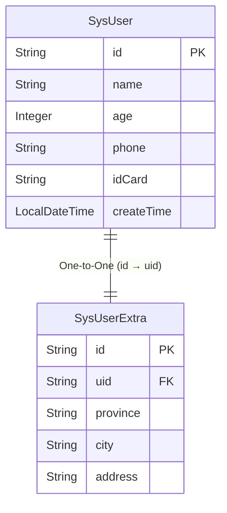

`eq` provides the `@Navigate` navigation property to define cascading relationships for database object relationships. Navigation properties support defining relationships between one or more database entities through one or more combined properties.

We call the class that defines the property `self` and the target property `target`, so we have the distinction of `selfProperty` and `targetProperty` when defining properties.

For property definitions, we generally have two choices:
- Object
- Collection

Object properties are generally `OneToOne` or `ManyToOne` or even `DirectMapping`, while collection property definitions are generally `OneToMany` or `ManyToMany`, where `ManyToMany` can be further divided into modes with or without a mapping table.

`OneToOne` and `ManyToOne` have very strict distinctions in their definitions. If there are two records in the `self` table corresponding to the `target` table, the relationship should be defined as `ManyToOne` rather than `OneToOne`, otherwise the framework will judge and report an error during `include` or `selectAutoInclude`. Of course, we consider `OneToOne` to be a special `ManyToOne`, so when you're not sure if it's `OneToOne`, defining it as `ManyToOne` is definitely not wrong. However, we still don't want you to blur this concept, so you can look at it from the reverse direction: what is the relationship from `target->self`? If it's `OneToMany`, then you can be sure that `self->target` should be `ManyToOne`.

Next, I will demonstrate how to define navigation properties to support complex relationships.

Supports building target table relationships from any object perspective, supports circular building, and navigation properties do not participate by default.

## Navigate

::: danger Warning!!!
> If you're using many-to-many with a mapping table, please do not sort the target table. The framework will sacrifice performance for accuracy to ensure correct results.
> The correct approach should be to sort in memory after retrieving the results.
:::


Property | Type   | Purpose  
---  | ---  | --- 
value  | RelationTypeEnum | Used to describe the specific relationship type, e.g., `@Navigate(value = RelationTypeEnum.OneToMany)`
selfProperty  | String[]  | The self properties used when associating with the target object, supports multiple. If multiple are added, they correspond one-to-one by array index. If not filled, it represents the primary key of the current table (only when there is a single primary key). Length must be consistent with `targetProperty` or `selfMappingProperty`
targetProperty  | String[]  | The target properties used when associating with the self object, supports multiple. If multiple are added, they correspond one-to-one by array index. If not filled, it represents the primary key of the target table (only when there is a single primary key). Length must be consistent with `selfProperty` or `targetMappingProperty`
mappingClass  | Class<?>  | The mapping table used for many-to-many, fill in the corresponding mapping table class, e.g., for `User Role UserRole`, fill in `UserRole.class`
selfMappingProperty  | String[]  | The mapping table properties used for many-to-many that associate with the current table's `selfProperty`, supports multiple, same length as `selfProperty`
targetMappingProperty  | String[]  | The mapping table properties used for many-to-many that associate with the current table's `targetProperty`, supports multiple, same length as `targetProperty`
propIsProxy  | boolean  | Set to true, for historical reasons to be compatible with non-entity mode and entity mode
orderByProps  | OrderByProperty[]  | For toMany, used to sort child tables when fetching data. For many-to-many with a mapping table, please do not sort as the framework will sacrifice performance for accuracy to ensure correct results
offset  | long  | For toMany, used to offset child tables when fetching data
limit  | long  | For toMany, used to limit child tables when fetching data
extraFilter  | Class<? extends NavigateExtraFilterStrategy>  | Extra filtering supports mapping tables and target tables
directMapping  | String[]  | Used to merge multiple ToOne
relationPropertyStrategy  | String | Used to manually specify conditions when customizing association relationships. For example, if you have comma-separated values, you may not use the equals sign for judgment but may use like left matching or dialect functions like findInSet
required  | boolean | Indicates whether the target object must exist. If you're using ManyToOne or OneToOne, implicit join will become inner join. If you're using OneToMany or ManyToMany, implicit group will use inner join for joining. For implicit partition by, index=0, i.e., firstElement also uses inner join, other cases use left join
subQueryToGroupJoin  | boolean | Convert subquery to groupJoin, only effective for toMany. It's recommended to enable this when data volume is greater than 200k-500k or when the system shows obvious subquery slowness

## One-to-One
One-to-one is essentially a special many-to-one relationship, commonly used in the field of vertical table splitting, such as users and their extended information tables.

::: tabs
@tab Relationship Diagram



@tab SysUser
```java

@Table("t_sys_user")
@EntityProxy
@Data
@FieldNameConstants
@EasyAlias("user")
public class SysUser implements ProxyEntityAvailable<SysUser , SysUserProxy> {
    @Column(primaryKey = true)
    private String id;
    private String name;
    private Integer age;
    private String phone;
    private String idCard;
    private LocalDateTime createTime;

    /**
     * User's extra information
     */
    @Navigate(value = RelationTypeEnum.OneToOne, selfProperty = {"id"}, targetProperty = {"uid"})
    private SysUserExtra userExtra;
}

```

@tab SysBankCard
```java

@Table("t_user_extra")
@EntityProxy
@Data
@FieldNameConstants
@EasyAlias("user_extra")
public class SysUserExtra implements ProxyEntityAvailable<SysUserExtra , SysUserExtraProxy> {
    @Column(primaryKey = true)
    private String id;
    private String uid;
    private String province;
    private String city;
    private String address;


    /**
     * User's extra information
     */
    @Navigate(value = RelationTypeEnum.OneToOne, selfProperty = {"uid"}, targetProperty = {"id"}, required=true)
    @ForeignKey//Optional
    private SysUser user;
}

```

:::

From the diagram, we can see that when `SysUser.id -> SysUserExtra.uid` are consistent, they are associated. In the `SysUser` class, all `SysUser properties` are `selfProperty` and all properties under `SysUserExtra` are called `targetProperty`. Of course, we can not only define `SysUserExtra` in `SysUser`, the reverse is also possible. All relationships allow bidirectional definitions.


## Many-to-One and One-to-Many

::: tabs
@tab Relationship Diagram


@tab SysUser
```java

@Table("t_sys_user")
@EntityProxy
@Data
@FieldNameConstants
@EasyAlias("user")
public class SysUser implements ProxyEntityAvailable<SysUser , SysUserProxy> {
    @Column(primaryKey = true)
    private String id;
    private String name;
    private String phone;
    private Integer age;
    private LocalDateTime createTime;

    /**
     * Number of bank cards owned by user
     */
    @Navigate(value = RelationTypeEnum.OneToMany, selfProperty = {"id"}, targetProperty = {"uid"})
    private List<SysBankCard> bankCards;
}

```

@tab SysBankCard
```java

@Table("t_bank_card")
@EntityProxy
@Data
@FieldNameConstants
@EasyAlias("bank_card")
public class SysBankCard implements ProxyEntityAvailable<SysBankCard , SysBankCardProxy> {
    @Column(primaryKey = true)
    private String id;
    private String uid;
    /**
     * Bank card number
     */
    private String code;
    /**
     * Bank card type: debit card, savings card
     */
    private String type;
    /**
     * Bank to which it belongs
     */
    private String bankId;
    /**
     * User account opening time
     */
    private LocalDateTime openTime;

    /**
     * Bank to which it belongs
     */
    @Navigate(value = RelationTypeEnum.ManyToOne, selfProperty = {"bankId"}, targetProperty = {"id"}, required=true)
    @ForeignKey//Optional
    private SysBank bank;

    /**
     * User to which it belongs
     */
    @Navigate(value = RelationTypeEnum.ManyToOne, selfProperty = {"uid"}, targetProperty = {"id"})
    private SysUser user;
}


```

@tab SysBank
```java

@Table("t_bank")
@EntityProxy
@Data
@FieldNameConstants
@EasyAlias("bank")
public class SysBank implements ProxyEntityAvailable<SysBank, SysBankProxy> {
    @Column(primaryKey = true)
    private String id;
    /**
     * Bank name
     */
    private String name;
    /**
     * Establishment time
     */
    private LocalDateTime createTime;

    /**
     * Bank cards owned
     */
    @Navigate(value = RelationTypeEnum.OneToMany,
            selfProperty = {"id"},
            targetProperty = {"bankId"})
    private List<SysBankCard> bankCards;
}

```

@tab SysBank
```java

@Table("t_bank")
@EntityProxy
@Data
@FieldNameConstants
@EasyAlias("bank")
public class SysBank implements ProxyEntityAvailable<SysBank, SysBankProxy> {
    @Column(primaryKey = true)
    private String id;
    /**
     * Bank name
     */
    private String name;
    /**
     * Establishment time
     */
    private LocalDateTime createTime;

    /**
     * Bank cards owned
     */
    @Navigate(value = RelationTypeEnum.OneToMany,
            selfProperty = {"id"},
            targetProperty = {"bankId"})
    private List<SysBankCard> bankCards;
}

```

:::

From the relationship diagram above, we can clearly see `Bank 1:N Bank Card`, `Bank Card N:1 User`. Each bank can issue multiple bank cards, and each user can also have multiple bank cards. For bank cards, it means multiple bank cards are associated with one user.


## Other Relationships
Due to space constraints, many-to-many, direct mapping, path mapping, comma redundancy and other mappings will be shown in separate chapters.

