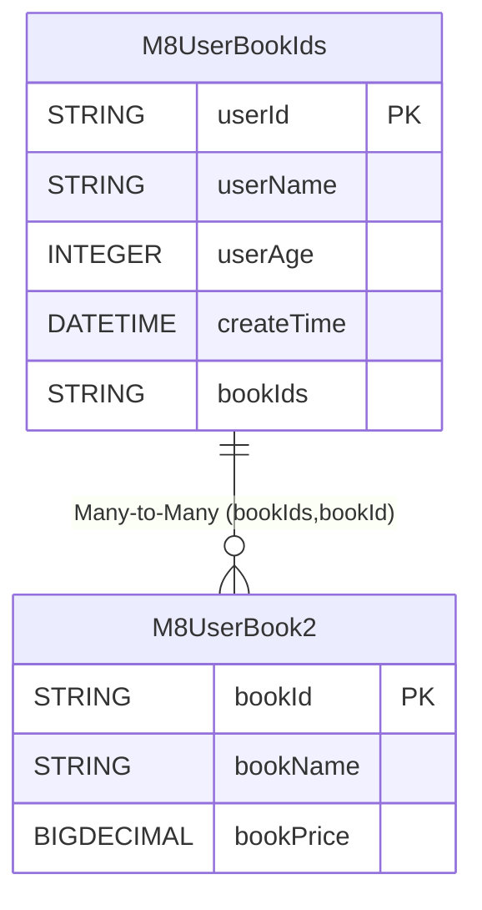

In business scenarios, we inevitably use comma-separated storage for `to-many` result sets, but most ORMs do not support this type of object relationship. EQ abstracts this part through advanced abstraction, allowing users to extend it themselves or submit a `PR` to the source code.

In standard scenarios, we still recommend users use many-to-many with mapping tables.

# Custom Association Relationships
`eq` provides standardized association relationships by default and supports association relationships under multiple properties, using equality as the condition to support both forward and reverse directions. However, there is no silver bullet in technology, so we often use denormalization techniques to achieve simpler and more convenient ways to store corresponding relationships. This non-standard relationship exists in a large number of business systems with various implementations, including comma separation, JSON storage, etc.

## EntityRelationPropertyProvider
Method  | Default Value | Description  
--- | --- | --- 
getName | Empty  | Define the name of the current component
toImplicitSubQuery | null  | How to define conditions when using implicit subqueries
toImplicitJoin | null  | How to define conditions when using implicit join
relationMultiIdsFetcherPredicate | null  | How to set condition values during `include`
relationMultiIdFetcherPredicate | null  | How to set condition values during `include` when `limit` is set
getOneToOneGetter | null  | How to get values for one-to-one abstraction
getDirectToOneGetter | null  | How to get values for direct relationship to-one
getManyToOneGetter | null  | How to get values for many-to-one
getOneToManyGetter | null  | How to get values for one-to-many
getManyToManyGetter | null  | How to get values for many-to-many

## Comma Separation


::: tabs

@tab Relationship Diagram


@tab M8UserBookIds
```java
@Data
@EntityProxy
@Table("m8_user_book_ids")
@FieldNameConstants
public class M8UserBookIds implements ProxyEntityAvailable<M8UserBookIds , M8UserBookIdsProxy> {
    @Column(primaryKey = true)
    private String userId;
    private String userName;
    private Integer userAge;
    private LocalDateTime createTime;

    private String bookIds;


    @Navigate(value = RelationTypeEnum.ManyToMany, selfProperty = {M8UserBookIds.Fields.bookIds}, targetProperty = {M8UserBook2.Fields.bookId}, relationPropertyStrategy ="find_in_set")
    private List<M8UserBook2> books;
}

```
@tab M8UserBook2
```java
@Data
@Table("m8_user_book2")
@EntityProxy
@FieldNameConstants
public class M8UserBook2 implements ProxyEntityAvailable<M8UserBook2, M8UserBook2Proxy> {
    @Column(primaryKey = true)
    private String bookId;
    private String bookName;
    private BigDecimal bookPrice;
}

```

:::

The `M8UserBookIds.bookIds` column uses comma separation to store `M8UserBook2.bookId` in a single column. In MySQL, the `find_in_set` function is used for implementation.

## FindInSetRelationToImplicitProvider
```java

public class FindInSetRelationToImplicitProvider implements EntityRelationPropertyProvider {
    public static final EntityRelationPropertyProvider INSTANCE = new FindInSetRelationToImplicitProvider();


    @Override
    public String getName() {
        return "find_in_set";
    }

    @Override
    public <T> ClientQueryable<T> toImplicitSubQuery(EntityExpressionBuilder entityExpressionBuilder, TableAvailable leftTable, NavigateMetadata navigateMetadata, QueryRuntimeContext runtimeContext) {

        ClientQueryable<?> clientQueryable = runtimeContext.getSQLClientApiFactory().createQueryable(navigateMetadata.getNavigatePropertyType(), runtimeContext);
        if (navigateMetadata.getRelationType() == RelationTypeEnum.ManyToMany && navigateMetadata.getMappingClass() != null) {
            throw new UnsupportedOperationException("many to many not support find_in_set");
        } else {
            clientQueryable.where(t -> {
                String[] targetPropertiesOrPrimary = navigateMetadata.getTargetPropertiesOrPrimary(runtimeContext);
                String[] selfPropertiesOrPrimary = navigateMetadata.getSelfPropertiesOrPrimary();
                t.and(() -> {
                    //This implements support for multi-property mode. If you don't support it, just use single property
                    for (int i = 0; i < targetPropertiesOrPrimary.length; i++) {
                        String property = targetPropertiesOrPrimary[i];
                        String selfProperty = selfPropertiesOrPrimary[i];
                        t.sqlNativeSegment("FIND_IN_SET({0},{1})", c -> {
                            c.expression(t.getTable(), property)
                                    .expression(leftTable, selfProperty);
                        });
                    }
//                    t.multiEq(true, new SimpleEntitySQLTableOwner<>(leftTable), navigateMetadata.getTargetPropertiesOrPrimary(runtimeContext), navigateMetadata.getSelfPropertiesOrPrimary());
                    navigateMetadata.predicateFilterApply(t);
                });
            });
        }
        return EasyObjectUtil.typeCastNullable(clientQueryable);
    }

    @Override
    public TableAvailable toImplicitJoin(EntityExpressionBuilder entityExpressionBuilder, TableAvailable leftTable, String property, String fullName) {
        return null;
    }

    @Override
    public void relationMultiIdsFetcherPredicate(WherePredicate<?> targetWherePredicate, String[] targetProps, List<List<Object>> relationIds) {
        //Only supports single property, implement multiple properties yourself
        String targetProp = targetProps[0];
        String collect = relationIds.stream().filter(o -> o.get(0) != null && EasyStringUtil.isNotBlank(o.get(0).toString()))
                .flatMap(o -> Arrays.stream(o.get(0).toString().split(",")))
                .distinct()
                .collect(Collectors.joining(","));

        targetWherePredicate.sqlNativeSegment("FIND_IN_SET({0},{1})", c -> {
            c.expression(targetProp).value(collect);
        });
//        targetWherePredicate.and(() -> {
//
//            for (List<Object> relationId : relationIds) {
//                Object o = relationId.get(0);
//
//                targetWherePredicate.sqlNativeSegment("FIND_IN_SET({0},{1})", c -> {
//                    c.expression(targetProp).value(o);
//                }).or();
//            }
//        });
    }

    @Override
    public void relationMultiIdFetcherPredicate(WherePredicate<?> targetWherePredicate, String[] targetProps, List<Object> relationIds) {

        String targetProp = targetProps[0];
        Object o = relationIds.get(0);
        targetWherePredicate.sqlNativeSegment("FIND_IN_SET({0},{1})", c -> {
            c.expression(targetProp).value(o);
        });
    }

    @Override
    public RelationIncludeGetter getOneToOneGetter(QueryRuntimeContext runtimeContext, NavigateMetadata navigateMetadata, String[] selfRelationColumn, Collection<RelationExtraEntity> entities) {
        return null;
    }

    @Override
    public RelationIncludeGetter getDirectToOneGetter(QueryRuntimeContext runtimeContext, NavigateMetadata navigateMetadata, List<RelationExtraEntity> includes, List<Object> mappingRow) {
        return null;
    }

    @Override
    public RelationIncludeGetter getManyToOneGetter(QueryRuntimeContext runtimeContext, NavigateMetadata navigateMetadata, String[] targetPropertyNames, List<RelationExtraEntity> includes) {
        return null;
    }

    @Override
    public RelationIncludeGetter getOneToManyGetter(QueryRuntimeContext runtimeContext, NavigateMetadata navigateMetadata, String[] targetPropertyNames, List<RelationExtraEntity> includes) {
        return null;
    }

    @Override
    public RelationIncludeGetter getManyToManyGetter(QueryRuntimeContext runtimeContext, NavigateMetadata navigateMetadata, String[] targetPropertyNames, List<RelationExtraEntity> includes, List<Object> mappingRows) {
        return new MyFindInSetManyToMany(includes);
    }

    public static class MyFindInSetManyToMany implements RelationIncludeGetter {
        private final List<RelationExtraEntity> includes;

        public MyFindInSetManyToMany(List<RelationExtraEntity> includes) {
            this.includes = includes;
        }

        @Override
        public boolean include() {
            return true;
        }

        @Override
        public Object getIncludeValue(RelationValue relationValue) {
            //For toMany interface, we want to return an empty collection instead of null if nothing is queried
            ArrayList<Object> objects = new ArrayList<>();
            if (relationValue.isNull()) {
                return objects;
            }
            for (RelationExtraEntity include : includes) {
                //If you want it to be generic, implement it yourself by referring to the equals implementation of RelationIncludeGetter. I'm using a specific cast here
                M8UserBook2 entity = (M8UserBook2) include.getEntity();
                List<Object> values = relationValue.getValues();
                Object o = values.get(0);
                String[] split = o.toString().split(",");
                for (String s : split) {
                    if (entity.getBookId().equals(s)) {
                        objects.add(entity);
                        ;
                    }
                }
            }
            return objects;
        }
    }
}
```

If you don't need additional processing, you only need to set the corresponding interface return like in the example, and if you don't know how to write `RelationIncludeGetter`, you can strongly type cast to your own type instead of blindly pursuing generality.


## Implicit Subquery

```java
 List<M8UserBookIds> list = easyEntityQuery.queryable(M8UserBookIds.class)
                .where(m -> {
                    m.books().any(x -> x.bookPrice().ge(BigDecimal.ZERO));
                })
                .toList();


-- SQL statement 1
SELECT
    t.`user_id`,
    t.`user_name`,
    t.`user_age`,
    t.`create_time`,
    t.`book_ids` 
FROM
    `m8_user_book_ids` t 
WHERE
    EXISTS (
        SELECT
            1 
        FROM
            `m8_user_book2` t1 
        WHERE
            FIND_IN_SET(t1.`book_id`,t.`book_ids`) 
            AND t1.`book_price` >= 0 LIMIT 1
    )
```

## include Fetch
```java

List<M8UserBookIds> list1 = easyEntityQuery.queryable(M8UserBookIds.class)
        .includes(m -> m.books())
        .toList();


-- SQL statement 1
SELECT
    `user_id`,
    `user_name`,
    `user_age`,
    `create_time`,
    `book_ids` 
FROM
    `m8_user_book_ids`
-- SQL statement 2
SELECT
    t.`book_id`,
    t.`book_name`,
    t.`book_price` 
FROM
    `m8_user_book2` t 
WHERE
    FIND_IN_SET(t.`book_id`,?)
```

