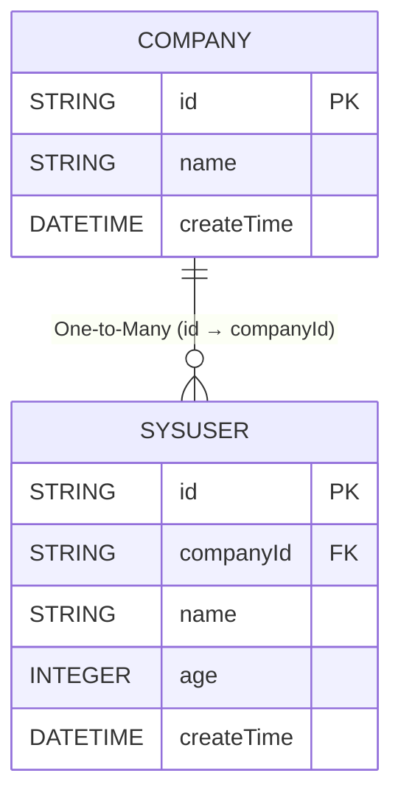

## Introduction
The best place to use `SELECT subqueries` is for returning aggregate information or counts from associated child tables. In most scenarios, using `SELECT subqueries` not only makes the code more elegant, but also allows for **`higher performance`**. We'll illustrate the pros and cons of `SELECT subqueries` with examples.


Before understanding SELECT subqueries, I recommend first taking a look at [associatedSubQuery](/easy-query-doc/en/ability/adv/associated-subquery)


## Introduction
`easy-query` can easily implement `select subqueries`, and has both manual and automatic modes. The specific SQL is as follows

Implementing SQL
```sql
select a,b,c,(select count(t1.id) from a t1) as xx from b
```


## Case



## API

method  | description 
--- | --- 
any() | Whether matching items exist equivalent to select count(*) > 0, returns Boolean
none() | Whether no matching items exist equivalent to select count(*) == 0, returns Boolean
where(Expression) | Subquery filter condition
orderBy(Expression) | Subquery sorting
firstElement() | Get the first element in navigation property result set, with or without orderBy, LIMIT 1, returns navigation element type
element(index) | Get the element at the specified index in navigation property result set with or without orderBy, LIMIT index+1, returns navigation element type. Index is also a property that can use expression lambda, returns navigation element type
elements(start,end) | Use LIMIT fetch navigation property result set elements with specified start, returns navigation collection type. Start and end are also properties that can use expression lambda
flatElement() | Flatten oneToMany. For example, there's an entity Company with a OneToMany property `List<User>`, flatElement() can return `User` type instead of `List<User>` type. Note: flatElement can only be used within select, and OneToMany field must be defined with @EasyQueryFlat or @EasyAssociate annotation
configure() | Method for subquery configuration, such as max nested levels and more (I believe you won't need this)
distinct() | Deduplication
anyValue() | Returns the aggregated value if matching records exist, otherwise returns null. Note: anyValue may return a null value so adjust return value type from primitive type to reference type like long->Long, int->Integer (returns null when empty otherwise returns result without IFNULL)
noneValue() | Returns null if matching records exist, otherwise returns the aggregated value. Note: noneValue may return a null value so adjust return value type from primitive type to reference type like long->Long, int->Integer (returns null when exists otherwise returns result without IFNULL)
count() | Returns the count of matching records, query result SELECT COUNT(*) will add IFNULL so return value can be primitive type like long (when empty returns 0)
sum() | Returns the sum of matching record field
avg() | Returns the average of matching record field
max() | Returns the maximum value of matching record field
min() | Returns the minimum value of matching record field
joining() | Special aggregation for associating column aggregation for oneToMany. Navigation property oneToMany will default generate GROUP_CONCAT in MySQL, STRING_AGG in SQL Server, LISTAGG in Oracle, etc. It defaults to comma separator


## Return Single Count
Query company ID and how many users each company has using implicit subquery

```java

List<Draft2<String, Long>> list = easyEntityQuery.queryable(Company.class)
        .where(com -> com.name().like("xx公司"))
        .select(com -> Select.DRAFT.of(
                com.id(),
                com.users().count()
        )).toList();

SELECT
    t.`id` AS `value1`,
    (SELECT
        COUNT(*) 
    FROM
        `t_user` t2 
    WHERE
        t2.`company_id` = t.`id`) AS `value2` 
FROM
    `t_company` t 
WHERE
    t.`name` LIKE '%xx公司%'
```


Use manual subquery
```java

List<Draft2<String, Long>> list = easyEntityQuery.queryable(Company.class)
        .where(com -> com.name().like("xx公司"))
        .select(com -> Select.DRAFT.of(
                com.id(),
                new LongProxy(
                        easyEntityQuery.queryable(SysUser.class)
                                .where(user -> {
                                    user.companyId().eq(com.id());
                                }).selectCount()//count(*)
                )
        )).toList();

SELECT
    t.`id` AS `value1`,
    (SELECT
        COUNT(*) 
    FROM
        `t_user` t1 
    WHERE
        t1.`company_id` = t.`id`) AS `value2` 
FROM
    `t_company` t 
WHERE
    t.`name` LIKE '%xx公司%'
```

::: warning Note!!!
> Manual subqueries need to wrap primitive types; otherwise, proxy class creation will fail
:::

Use implicit GROUP_BY (most elegant, most highly recommended)
```java

List<Draft2<String, Long>> list = easyEntityQuery.queryable(Company.class)
        .where(com -> com.name().like("xx公司"))
        .subQueryToGroupJoin(com -> com.users())//Need GROUP_BY, let eq automatically JOIN a GROUP_BY view
        .select(com -> Select.DRAFT.of(
                com.id(),
                com.users().count()
        )).toList();

SELECT
    t.`id` AS `value1`,
    IFNULL(t2.`__count2__`, 0) AS `value2` 
FROM
    `t_company` t 
LEFT JOIN
    (SELECT
        t1.`company_id` AS `companyId`, COUNT(*) AS `__count2__` FROM `t_user` t1 
    GROUP BY
        t1.`company_id`) t2 
            ON t2.`companyId` = t.`id` 
WHERE
    t.`name` LIKE '%xx公司%'
```

::: tip Performance Note!!!
> In large data volumes, generally `implicit GROUP_BY LEFT JOIN aggregate view` has the best performance, then `SELECT subquery`, and finally `LEFT JOIN aggregate without GROUP BY`
:::

## Return Multiple Counts
Query company ID and how many users with surname Li each company has using implicit subquery

```java

List<Draft2<String, Long>> list = easyEntityQuery.queryable(Company.class)
        .where(com -> com.name().like("xx公司"))
        .select(com -> Select.DRAFT.of(
                com.id(),
                com.users().where(user->user.name().likeMatchLeft("李")).count()
        )).toList();
        

SELECT
    t.`id` AS `value1`,
    (SELECT
        COUNT(*) 
    FROM
        `t_user` t2 
    WHERE
        t2.`company_id` = t.`id` 
        AND t2.`name` LIKE '李%') AS `value2` 
FROM
    `t_company` t 
WHERE
    t.`name` LIKE '%xx公司%'
```


Query company ID, how many users with surname Li each company has, and how many users with surname Chen each company has using implicit subquery

```java

List<Draft3<String, Long, Long>> list = easyEntityQuery.queryable(Company.class)
        .where(com -> com.name().like("xx公司"))
        .select(com -> Select.DRAFT.of(
                com.id(),
                com.users().where(user -> user.name().likeMatchLeft("李")).count(),
                com.users().where(user -> user.name().likeMatchLeft("陈")).count()
        )).toList();
        

SELECT
    t.`id` AS `value1`,
    (SELECT
        COUNT(*) 
    FROM
        `t_user` t2 
    WHERE
        t2.`company_id` = t.`id` 
        AND t2.`name` LIKE '李%') AS `value2`,
    (SELECT
        COUNT(*) 
    FROM
        `t_user` t3 
    WHERE
        t3.`company_id` = t.`id` 
        AND t3.`name` LIKE '陈%') AS `value3` 
FROM
    `t_company` t 
WHERE
    t.`name` LIKE '%xx公司%'
```

Use implicit GROUP_BY to complete the above requirement

```java

List<Draft3<String, Long, Long>> list = easyEntityQuery.queryable(Company.class)
        .where(com -> com.name().like("xx公司"))
        .subQueryToGroupJoin(com -> com.users())//告诉eq这次查询需要使用implicitGROUP_BY
        .select(com -> Select.DRAFT.of(
                com.id(),
                com.users().where(user -> user.name().likeMatchLeft("李")).count(),
                com.users().where(user -> user.name().likeMatchLeft("陈")).count()
        )).toList();
        

SELECT
    t.`id` AS `value1`,
    IFNULL(t2.`__count2__`, 0) AS `value2`,
    IFNULL(t3.`__count3__`, 0) AS `value3` 
FROM
    `t_company` t 
LEFT JOIN
    (SELECT
        t1.`company_id` AS `companyId`,
        COUNT(*) AS `__count2__` 
    FROM
        `t_user` t1 
    WHERE
        t1.`name` LIKE '李%' 
    GROUP BY
        t1.`company_id`) t2 
            ON t2.`companyId` = t.`id` 
LEFT JOIN
    (SELECT
        t4.`company_id` AS `companyId`,
        COUNT(*) AS `__count3__` 
    FROM
        `t_user` t4 
    WHERE
        t4.`name` LIKE '陈%' 
    GROUP BY
        t4.`company_id`) t3 
            ON t3.`companyId` = t.`id` 
WHERE
    t.`name` LIKE '%xx公司%'
```

Query company ID and the sum of ages of users with surname Li in each company using implicit subquery
```java

List<Draft2<String, Integer>> list = easyEntityQuery.queryable(Company.class)
        .where(com -> com.name().like("xx公司"))
        .select(com -> Select.DRAFT.of(
                com.id(),
                com.users().where(user->user.name().likeMatchLeft("李")).sum(x->x.age())
        )).toList();


SELECT
    t.`id` AS `value1`,
    IFNULL((SELECT
        SUM(t2.`age`) 
    FROM
        `t_user` t2 
    WHERE
        t2.`company_id` = t.`id` 
        AND t2.`name` LIKE '李%'),
    0) AS `value2` 
FROM
    `t_company` t 
WHERE
    t.`name` LIKE '%xx公司%'
```

::: tip Tip!!!
> Regarding `subQueryToGroupJoin`, you can pass parameters for each step, or you can collectively convert at the end with `.subQueryToGroupJoin()` with no parameters for implicit conversions not explicitly set
:::


## Fetch Element
Next we'll show how to fetch content from the first element in a sorted collection

```java

List<Draft2<String, String>> list = easyEntityQuery.queryable(Company.class)
        .where(com -> com.name().like("xx公司"))
        .select(com -> Select.DRAFT.of(
                com.id(),
                // Return the name of the youngest user in the company
                com.users().orderBy(user -> user.age().asc()).firstElement().name()
        )).toList();

SELECT
    t.`id` AS `value1`,
    (SELECT
        t2.`name` 
    FROM
        `t_user` t2 
    WHERE
        t2.`company_id` = t.`id` 
    ORDER BY
        t2.`age` ASC 
    LIMIT 1) AS `value2` 
FROM
    `t_company` t 
WHERE
    t.`name` LIKE '%xx公司%'
```

