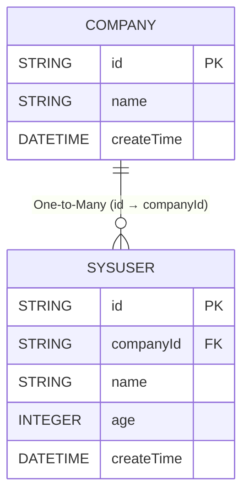

# select subquery
`easy-query` can easily implement `select subqueries`, and has both manual and automatic modes. The specific SQL is as follows

Implementing SQL
```sql
select a,b,c,(select count(t1.id) from a t1) as xx from b
```

## Database Object Model
::: code-tabs
@tab Relationship Diagram


@tab Company Table
```java
@Table("t_company")
@Data
@EntityProxy
@FieldNameConstants
@EasyAlias("com")
public class Company implements ProxyEntityAvailable<Company , CompanyProxy> {
    @Column(primaryKey = true)
    private String id;
    private String name;
    private LocalDateTime createTime;

    @Navigate(value = RelationTypeEnum.OneToMany,targetProperty = SysUser.Fields.companyId)
    private List<SysUser> users;
}
```

@tab User Table
```java
@Table("t_user")
@Data
@EntityProxy
@FieldNameConstants
@EasyAlias("user")
public class SysUser implements ProxyEntityAvailable<SysUser , SysUserProxy> {
    @Column(primaryKey = true)
    private String id;
    private String companyId;
    private String name;
    private Integer age;
    private LocalDateTime createTime;


    @Navigate(value = RelationTypeEnum.ManyToOne,selfProperty = Fields.companyId)
    private Company company;
}
```
::: 

## Automatic Mode
Query company ID and how many users each company has
```java

List<Draft2<String, Long>> list = easyEntityQuery.queryable(Company.class)
        .where(com -> com.name().like("xx公司"))
        .select(com -> Select.DRAFT.of(
                com.id(),
                com.users().count()
        )).toList();

SELECT
    t.`id` AS `value1`,
    (SELECT
        COUNT(*) 
    FROM
        `t_user` t2 
    WHERE
        t2.`company_id` = t.`id`) AS `value2` 
FROM
    `t_company` t 
WHERE
    t.`name` LIKE '%xx公司%'
```


Query company ID and how many users with surname Li each company has

```java

List<Draft2<String, Long>> list = easyEntityQuery.queryable(Company.class)
        .where(com -> com.name().like("xx公司"))
        .select(com -> Select.DRAFT.of(
                com.id(),
                com.users().where(user->user.name().likeMatchLeft("李")).count()
        )).toList();
        

SELECT
    t.`id` AS `value1`,
    (SELECT
        COUNT(*) 
    FROM
        `t_user` t2 
    WHERE
        t2.`company_id` = t.`id` 
        AND t2.`name` LIKE '李%') AS `value2` 
FROM
    `t_company` t 
WHERE
    t.`name` LIKE '%xx公司%'
```

Query company ID and the sum of ages of users with surname Li in each company
```java

List<Draft2<String, Integer>> list = easyEntityQuery.queryable(Company.class)
        .where(com -> com.name().like("xx公司"))
        .select(com -> Select.DRAFT.of(
                com.id(),
                com.users().where(user->user.name().likeMatchLeft("李")).sum(x->x.age())
        )).toList();


SELECT
    t.`id` AS `value1`,
    IFNULL((SELECT
        SUM(t2.`age`) 
    FROM
        `t_user` t2 
    WHERE
        t2.`company_id` = t.`id` 
        AND t2.`name` LIKE '李%'),
    0) AS `value2` 
FROM
    `t_company` t 
WHERE
    t.`name` LIKE '%xx公司%'
```
## Optimization
If the default performance of `select subqueries` is not ideal under large data volumes, is there a way to use it with higher performance? For example, under pagination, we first filter the result set and then perform `select subqueries`, or we first limit the result set and then perform select subqueries, which will greatly improve performance. How to use it? In the new version 2.0.78+, `eq` provides `limitSelect` and `toPageSelectResult` to facilitate users in handling this operation

### Unoptimized Version
```java

EasyPageResult<Draft2<String, Integer>> pageResult = easyEntityQuery.queryable(Company.class)
        .where(com -> com.name().like("xx公司"))
        .select(com -> Select.DRAFT.of(
                com.id(),
                com.users().where(u -> u.name().likeMatchLeft("李")).sum(u -> u.age())
        )).toPageResult(2, 10);

//Get count
SELECT 
    COUNT(*) 
FROM 
    `t_company` t 
WHERE 
    t.`name` LIKE '%xx公司%'

//Get results
SELECT
    t.`id` AS `value1`,
    IFNULL((SELECT
        SUM(t2.`age`) 
    FROM
        `t_user` t2 
    WHERE
        t2.`company_id` = t.`id` 
        AND t2.`name` LIKE '李%'),
    0) AS `value2` 
FROM
    `t_company` t 
WHERE
    t.`name` LIKE '%xx公司%' LIMIT 10 OFFSET 10
```

### Optimized Version
```java
//Put the select operation in a separate anonymous expression
EasyPageResult<Draft2<String, Integer>> pageResult = easyEntityQuery.queryable(Company.class)
                .where(com -> com.name().like("xx公司"))
                .toPageSelectResult(q -> {
                    return q.select(com->Select.DRAFT.of(
                            com.id(),
                            com.users().where(u -> u.name().likeMatchLeft("李")).sum(u -> u.age())
                    ));
                },2, 10);


//Get count
SELECT 
    COUNT(*) 
FROM 
    `t_company` t 
WHERE 
    t.`name` LIKE '%xx公司%'

//Get results
SELECT
    t1.`id` AS `value1`,
    IFNULL((SELECT
        SUM(t3.`age`) 
    FROM
        `t_user` t3 
    WHERE
        t3.`company_id` = t1.`id` 
        AND t3.`name` LIKE '李%'),
    0) AS `value2` 
FROM
    (SELECT
        t.`id`,
        t.`name`,
        t.`create_time` 
    FROM
        `t_company` t 
    WHERE
        t.`name` LIKE '%xx公司%' LIMIT 10 OFFSET 10) t1
```
The difference is that the subquery is placed outside to achieve high-performance subqueries with minimal granularity

### Optimized Version Step-by-Step Query
```java
//Create expression
EntityQueryable<CompanyProxy, Company> queryable = easyEntityQuery.queryable(Company.class)
            .where(com -> com.name().like("xx公司"));

//Get total            
long total = queryable.cloneQueryable().count();
//Perform limit first, then select
List<Draft2<String, Integer>> data = queryable.cloneQueryable().limitSelect(10, 10, com -> Select.DRAFT.of(
        com.id(),
        com.users().where(u -> u.name().likeMatchLeft("李")).sum(u -> u.age())
)).toList();
```

### Optimized Original Version Step-by-Step Query
```java
 EntityQueryable<CompanyProxy, Company> queryable = easyEntityQuery.queryable(Company.class)
                .where(com -> com.name().like("xx公司"));
long total = queryable.cloneQueryable().count();
//limit+select+select is the default implementation of limitSelect. If you are using an older version, you can call it this way to implement optimized subqueries
List<Draft2<String, Integer>> data = queryable.cloneQueryable().limit(10, 10)
        .select(com -> com)
        .select(com -> Select.DRAFT.of(
                com.id(),
                com.users().where(u -> u.name().likeMatchLeft("李")).sum(u -> u.age())
        )).toList();
```

## Manual Mode
::: code-tabs
@tab Object Mode
```java
@Data
@EntityProxy
public class TopicSubQueryBlog implements ProxyEntityAvailable<TopicSubQueryBlog , TopicSubQueryBlogProxy> {
    private String id;
    private Integer stars;
    private String title;
    private LocalDateTime createTime;
    private Long blogCount;

}

:::


::: code-tabs
@tab Object Mode
```java
        List<TopicSubQueryBlog> list = easyEntityQuery.queryable(Topic.class)
                .where(o -> o.title().isNotNull())
                .select(o->{
                    TopicSubQueryBlogProxy r =new TopicSubQueryBlogProxy();
                    r.selectAll(o);
                    Query<Long> subQuery = easyEntityQuery.queryable(BlogEntity.class).where(x -> x.id().eq(o.id())).selectCount();//count(*)
                    r.blogCount().setSubQuery(subQuery);
                    return r;
                }).toList();

==> Preparing: SELECT t.`id`,t.`stars`,t.`title`,t.`create_time`,(SELECT COUNT(*) FROM `t_blog` t1 WHERE t1.`deleted` = ? AND t1.`id` = t.`id`) AS `blog_count` FROM `t_topic` t WHERE t.`title` IS NOT NULL
==> Parameters: false(Boolean)
<== Time Elapsed: 6(ms)
<== Total: 99
        
```
:::


## sum with joins for aggregation

::: code-tabs
@tab Object Mode
```java

        List<TopicSubQueryBlog> list = easyEntityQuery.queryable(Topic.class)
                .where(o -> o.title().isNotNull())
                .select(o->new TopicSubQueryBlogProxy()
                    .selectAll(o)
                    .blogCount().setSubQuery(//SUM(t1.`star`)
                            easyEntityQuery.queryable(BlogEntity.class).where(x -> x.id().eq(o.id())).select(x -> new LongProxy(x.star().sum()))
                        )
                ).toList();

==> Preparing: SELECT t.`id`,t.`stars`,t.`title`,t.`create_time`,(SELECT SUM(t1.`star`) FROM `t_blog` t1 WHERE t1.`deleted` = ? AND t1.`id` = t.`id`) AS `blog_count` FROM `t_topic` t WHERE t.`title` IS NOT NULL
==> Parameters: false(Boolean)
<== Time Elapsed: 6(ms)
<== Total: 99
        
```
:::

`max`, `min` work the same way

