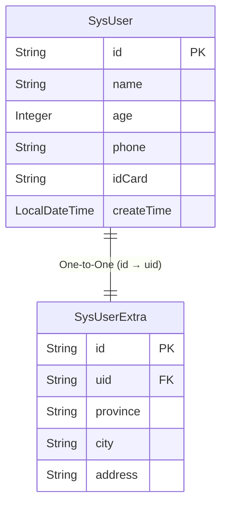

`eq`提供了`@Navigate`导航属性来作为数据库对象关系的级联关系定义,导航属性支持将一个或者多个数据库实体通过一个属性或者多个属性组合进行关系定义。

我们将定义属性的类称作`self`目标属性称为`target`，所以我们在定义属性的时候会有`selfProperty`和`targetProperty`的区分

属性的定义我们一般拥有两种选择
- 对象
- 集合

对象属性一般是`OneToOne`或者`ManyToOne`亦或者是`DirectMapping`,而集合的属性定义一般为`OneToMany`或`ManyToMany`,其中`ManyToMany`又可以分为有中间表或者无中间表模式.

`OneToOne`和`ManyToOne`在定义的时候是有着十分严格的区别,如果`self`表里面有两条数据对应`target`表那么关系应该被定义为`ManyToOne`而不是`OneToOne`否则在`include`或者`selectAutoInclude`的时候框架会进行判断并且报错，当然我们认为`OneToOne`是一种特殊的`ManyToOne`所以当你不确定是否是`OneToOne`的时候你定义`ManyToOne`是肯定不会错的。但是我们还是不希望你将次概念模糊掉,所以你可以反向来看`target->self`的关系是什么如果是`OneToMany`那么你可以确定`self->target`应该是`ManyToOne`

接下来我将展示如何定义导航属性来支持复杂关系

支持任意对象为视角构建目标表关系,支持循环构建,导航属性默认不参与

## Navigate


属性 | 类型   | 作用  
---  | ---  | --- 
value  | RelationTypeEnum | 用来描述具体关系类型比如` @Navigate(value = RelationTypeEnum.OneToMany)`
selfProperty  | String[]  | 和目标对象关联时使用的自身属性支持多个,如果添加多个则按数组索引一一对应,如果不填写则表示为当前表的主键(必须是一个主键时才可以不填写),长度必须和`targetProperty`或`selfMappingProperty`一致
targetProperty  | String[]  | 和自身对象关联时使用的目标属性支持多个,如果添加多个则按数组索引一一对应,如果不填写则表示为目标表的主键(必须是一个主键时才可以不填写),长度必须和`selfProperty`或`targetMappingProperty`一致
mappingClass  | Class<?>  | 多对多时使用的中间表,填写对应的中间表class,比如`User Role UserRole`则填写`UserRole.class`
selfMappingProperty  | String[]  | 多对多时使用的中间表属性和当前表的`selfProperty`关联的属性,支持多个，长度和`selfProperty`一样
targetMappingProperty  | String[]  | 多对多时使用的中间表属性和当前表的`targetProperty`关联的属性,支持多个，长度和`targetProperty`一样
propIsProxy  | boolean  | 设置为true即可,历史原因兼容非entity模式和entity模式
orderByProps  | OrderByProperty[]  | toMany，用于拉取数据的时候对子表进行排序
offset  | long  | toMany，用于拉取数据的时候对子表进行排序
limit  | long  | toMany，用于拉取数据的时候对子表进行排序
extraFilter  | Class<? extends NavigateExtraFilterStrategy>  | 额外筛选支持中间表和目标表
directMapping  | String[]  | 用于合并多个ToOne
relationPropertyStrategy  | String | 自定义关联关系时用于手动指定条件比如你是逗号分割那么不是以等于符号进行判断可能会用like左匹配或者findInSet这种方言函数

## 一对一
一对一本质是特殊的多对一关系,常用于垂直分表领域,比如用户和用户的扩展信息表

::: tabs
@tab 关系图



@tab SysUser
```java

@Table("t_sys_user")
@EntityProxy
@Data
@FieldNameConstants
@EasyAlias("user")
public class SysUser implements ProxyEntityAvailable<SysUser , SysUserProxy> {
    @Column(primaryKey = true)
    private String id;
    private String name;
    private Integer age;
    private String phone;
    private String idCard;
    private LocalDateTime createTime;

    /**
     * 用户其余额外信息
     */
    @Navigate(value = RelationTypeEnum.OneToOne, selfProperty = {"id"}, targetProperty = {"uid"})
    private SysUserExtra userExtra;
}

```

@tab SysBankCard
```java

@Table("t_user_extra")
@EntityProxy
@Data
@FieldNameConstants
@EasyAlias("user_extra")
public class SysUserExtra implements ProxyEntityAvailable<SysUserExtra , SysUserExtraProxy> {
    @Column(primaryKey = true)
    private String id;
    private String uid;
    private String province;
    private String city;
    private String address;


    /**
     * 用户其余额外信息
     */
    @Navigate(value = RelationTypeEnum.OneToOne, selfProperty = {"uid"}, targetProperty = {"id"})
    @ForeignKey//可以不加 加了就是InnerJoin处理更多细节查看注解篇章
    private SysUser user;
}

```

:::

从图表我们可以看出`SysUser.id -> SysUserExtra.uid`一致的情况下那么两者进行关联,我们在`SysUser`这个类中所有的`SysUser的属性`都是`selfProperty`而且所有的`SysUserExtra`下的属性都称之为`targetProperty`,当然我们不但可以在`SysUser`中定义`SysUserExtra`反之亦可以所有的关系都是允许双向定义的


## 多对一和一对多

::: tabs
@tab 关系图


@tab SysUser
```java

@Table("t_sys_user")
@EntityProxy
@Data
@FieldNameConstants
@EasyAlias("user")
public class SysUser implements ProxyEntityAvailable<SysUser , SysUserProxy> {
    @Column(primaryKey = true)
    private String id;
    private String name;
    private String phone;
    private Integer age;
    private LocalDateTime createTime;

    /**
     * 用户拥有的银行卡数
     */
    @Navigate(value = RelationTypeEnum.OneToMany, selfProperty = {"id"}, targetProperty = {"uid"})
    private List<SysBankCard> bankCards;
}

```

@tab SysBankCard
```java

@Table("t_bank_card")
@EntityProxy
@Data
@FieldNameConstants
@EasyAlias("bank_card")
public class SysBankCard implements ProxyEntityAvailable<SysBankCard , SysBankCardProxy> {
    @Column(primaryKey = true)
    private String id;
    private String uid;
    /**
     * 银行卡号
     */
    private String code;
    /**
     * 银行卡类型借记卡 储蓄卡
     */
    private String type;
    /**
     * 所属银行
     */
    private String bankId;
    /**
     * 用户开户时间
     */
    private LocalDateTime openTime;

    /**
     * 所属银行
     */
    @Navigate(value = RelationTypeEnum.ManyToOne, selfProperty = {"bankId"}, targetProperty = {"id"})
    @ForeignKey//可以不加 加了就是InnerJoin处理更多细节查看注解篇章
    private SysBank bank;

    /**
     * 所属用户
     */
    @Navigate(value = RelationTypeEnum.ManyToOne, selfProperty = {"uid"}, targetProperty = {"id"})
    private SysUser user;
}


```

@tab SysBank
```java

@Table("t_bank")
@EntityProxy
@Data
@FieldNameConstants
@EasyAlias("bank")
public class SysBank implements ProxyEntityAvailable<SysBank, SysBankProxy> {
    @Column(primaryKey = true)
    private String id;
    /**
     * 银行名称
     */
    private String name;
    /**
     * 成立时间
     */
    private LocalDateTime createTime;

    /**
     * 拥有的银行卡
     */
    @Navigate(value = RelationTypeEnum.OneToMany,
            selfProperty = {"id"},
            targetProperty = {"bankId"})
    private List<SysBankCard> bankCards;
}

```

@tab SysBank
```java

@Table("t_bank")
@EntityProxy
@Data
@FieldNameConstants
@EasyAlias("bank")
public class SysBank implements ProxyEntityAvailable<SysBank, SysBankProxy> {
    @Column(primaryKey = true)
    private String id;
    /**
     * 银行名称
     */
    private String name;
    /**
     * 成立时间
     */
    private LocalDateTime createTime;

    /**
     * 拥有的银行卡
     */
    @Navigate(value = RelationTypeEnum.OneToMany,
            selfProperty = {"id"},
            targetProperty = {"bankId"})
    private List<SysBankCard> bankCards;
}

```

:::

通过上述关系图我们可以清晰地看到`银行 1:N 银行卡`，`银行卡 N:1 用户`,每个银行都可以发行多张银行卡,每个用户也可以拥有多张银行卡,对于银行卡而言就是多张银行卡关联到一个用户上面


## 其他关系
由于篇幅关系,多对多喝直接映射，路径映射，逗号冗余等映射将会用单独篇章展示
