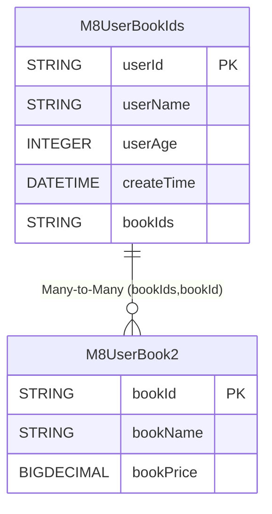

业务场景中我们不可避免的会使用逗号分割存储`对多`结果集,但是大部分orm并不支持这种对象关系,eq通过高级的抽象将这一部分抽象出来用户可以自行扩展或`pr`到源码

# 自定义关联关系
`eq`默认提供了标准化关联关系,并且支持多属性下的关联关系,关系之间使用等于来作为条件支持正向和反向两种,但是技术没有银弹所以很多时候我们会使用反范式技术来实现更加简洁,简便的方式来实现存储对应关系这种非标准关系存在于大量的业务系统中,并且实现各有不同,有逗号分割有json存储等

## EntityRelationPropertyProvider
方法  | 默认值 | 描述  
--- | --- | --- 
getName | 空  | 定义当前组件的名称
toImplicitSubQuery | null  | 当使用隐式子查询时候如何定义条件
toImplicitJoin | null  | 当使用隐式join的时候如何定义条件
relationMultiIdsFetcherPredicate | null  | 当`include`的时候如何设置条件值
relationMultiIdFetcherPredicate | null  | 当`include`的时候并且设置了`limit`的时候如何设置条件值
getOneToOneGetter | null  | 一对一抽象如何获取值
getDirectToOneGetter | null  | 直接关系对一如何获取值
getManyToOneGetter | null  | 多对一如何获取值
getOneToManyGetter | null  | 一对多如何获取值
getManyToManyGetter | null  | 多对多如何获取值

## 逗号分割


::: tabs

@tab 关系图


@tab M8UserBookIds
```java
@Data
@EntityProxy
@Table("m8_user_book_ids")
@FieldNameConstants
public class M8UserBookIds implements ProxyEntityAvailable<M8UserBookIds , M8UserBookIdsProxy> {
    @Column(primaryKey = true)
    private String userId;
    private String userName;
    private Integer userAge;
    private LocalDateTime createTime;

    private String bookIds;


    @Navigate(value = RelationTypeEnum.ManyToMany, selfProperty = {M8UserBookIds.Fields.bookIds}, targetProperty = {M8UserBook2.Fields.bookId}, relationPropertyStrategy ="find_in_set")
    private List<M8UserBook2> books;
}

```
@tab M8UserBook2
```java
@Data
@Table("m8_user_book2")
@EntityProxy
@FieldNameConstants
public class M8UserBook2 implements ProxyEntityAvailable<M8UserBook2, M8UserBook2Proxy> {
    @Column(primaryKey = true)
    private String bookId;
    private String bookName;
    private BigDecimal bookPrice;
}

```

:::

`M8UserBookIds.bookIds`列使用逗号分割将`M8UserBook2.bookId`存储到单列中，mysql下使用`find_in_set`函数来实现

## FindInSetRelationToImplicitProvider
```java

public class FindInSetRelationToImplicitProvider implements EntityRelationPropertyProvider {
    public static final EntityRelationPropertyProvider INSTANCE = new FindInSetRelationToImplicitProvider();


    @Override
    public String getName() {
        return "find_in_set";
    }

    @Override
    public <T> ClientQueryable<T> toImplicitSubQuery(EntityExpressionBuilder entityExpressionBuilder, TableAvailable leftTable, NavigateMetadata navigateMetadata, QueryRuntimeContext runtimeContext) {

        ClientQueryable<?> clientQueryable = runtimeContext.getSQLClientApiFactory().createQueryable(navigateMetadata.getNavigatePropertyType(), runtimeContext);
        if (navigateMetadata.getRelationType() == RelationTypeEnum.ManyToMany && navigateMetadata.getMappingClass() != null) {
            throw new UnsupportedOperationException("many to many not support find_in_set");
        } else {
            clientQueryable.where(t -> {
                String[] targetPropertiesOrPrimary = navigateMetadata.getTargetPropertiesOrPrimary(runtimeContext);
                String[] selfPropertiesOrPrimary = navigateMetadata.getSelfPropertiesOrPrimary();
                t.and(() -> {
                    //这边实现了支持多属性模式如果你不支持直接使用单属性即可
                    for (int i = 0; i < targetPropertiesOrPrimary.length; i++) {
                        String property = targetPropertiesOrPrimary[i];
                        String selfProperty = selfPropertiesOrPrimary[i];
                        t.sqlNativeSegment("FIND_IN_SET({0},{1})", c -> {
                            c.expression(t.getTable(), property)
                                    .expression(leftTable, selfProperty);
                        });
                    }
//                    t.multiEq(true, new SimpleEntitySQLTableOwner<>(leftTable), navigateMetadata.getTargetPropertiesOrPrimary(runtimeContext), navigateMetadata.getSelfPropertiesOrPrimary());
                    navigateMetadata.predicateFilterApply(t);
                });
            });
        }
        return EasyObjectUtil.typeCastNullable(clientQueryable);
    }

    @Override
    public TableAvailable toImplicitJoin(EntityExpressionBuilder entityExpressionBuilder, TableAvailable leftTable, String property, String fullName) {
        return null;
    }

    @Override
    public void relationMultiIdsFetcherPredicate(WherePredicate<?> targetWherePredicate, String[] targetProps, List<List<Object>> relationIds) {
        //仅支持单个属性多个属性自己去实现
        String targetProp = targetProps[0];
        String collect = relationIds.stream().filter(o -> o.get(0) != null && EasyStringUtil.isNotBlank(o.get(0).toString()))
                .flatMap(o -> Arrays.stream(o.get(0).toString().split(",")))
                .distinct()
                .collect(Collectors.joining(","));

        targetWherePredicate.sqlNativeSegment("FIND_IN_SET({0},{1})", c -> {
            c.expression(targetProp).value(collect);
        });
//        targetWherePredicate.and(() -> {
//
//            for (List<Object> relationId : relationIds) {
//                Object o = relationId.get(0);
//
//                targetWherePredicate.sqlNativeSegment("FIND_IN_SET({0},{1})", c -> {
//                    c.expression(targetProp).value(o);
//                }).or();
//            }
//        });
    }

    @Override
    public void relationMultiIdFetcherPredicate(WherePredicate<?> targetWherePredicate, String[] targetProps, List<Object> relationIds) {

        String targetProp = targetProps[0];
        Object o = relationIds.get(0);
        targetWherePredicate.sqlNativeSegment("FIND_IN_SET({0},{1})", c -> {
            c.expression(targetProp).value(o);
        });
    }

    @Override
    public RelationIncludeGetter getOneToOneGetter(QueryRuntimeContext runtimeContext, NavigateMetadata navigateMetadata, String[] selfRelationColumn, Collection<RelationExtraEntity> entities) {
        return null;
    }

    @Override
    public RelationIncludeGetter getDirectToOneGetter(QueryRuntimeContext runtimeContext, NavigateMetadata navigateMetadata, List<RelationExtraEntity> includes, List<Object> mappingRow) {
        return null;
    }

    @Override
    public RelationIncludeGetter getManyToOneGetter(QueryRuntimeContext runtimeContext, NavigateMetadata navigateMetadata, String[] targetPropertyNames, List<RelationExtraEntity> includes) {
        return null;
    }

    @Override
    public RelationIncludeGetter getOneToManyGetter(QueryRuntimeContext runtimeContext, NavigateMetadata navigateMetadata, String[] targetPropertyNames, List<RelationExtraEntity> includes) {
        return null;
    }

    @Override
    public RelationIncludeGetter getManyToManyGetter(QueryRuntimeContext runtimeContext, NavigateMetadata navigateMetadata, String[] targetPropertyNames, List<RelationExtraEntity> includes, List<Object> mappingRows) {
        return new MyFindInSetManyToMany(includes);
    }

    public static class MyFindInSetManyToMany implements RelationIncludeGetter {
        private final List<RelationExtraEntity> includes;

        public MyFindInSetManyToMany(List<RelationExtraEntity> includes) {
            this.includes = includes;
        }

        @Override
        public boolean include() {
            return true;
        }

        @Override
        public Object getIncludeValue(RelationValue relationValue) {
            //toMany接口我们希望是如果没有查询到应该返回对应的空集合而不是null
            ArrayList<Object> objects = new ArrayList<>();
            if (relationValue.isNull()) {
                return objects;
            }
            for (RelationExtraEntity include : includes) {
                //如果要通用自己去实现参考RelationIncludeGetter的equals实现我这边是给专用的直接强转
                M8UserBook2 entity = (M8UserBook2) include.getEntity();
                List<Object> values = relationValue.getValues();
                Object o = values.get(0);
                String[] split = o.toString().split(",");
                for (String s : split) {
                    if (entity.getBookId().equals(s)) {
                        objects.add(entity);
                        ;
                    }
                }
            }
            return objects;
        }
    }
}
```

如果你不需要额外的处理那么只需要像案例一样设置对应的接口返回即可,并且如果自己不知道如何编写`RelationIncludeGetter`那么可以使用强类型转成自己的类型而不是一味地追求通用性


## 隐式子查询

```java
 List<M8UserBookIds> list = easyEntityQuery.queryable(M8UserBookIds.class)
                .where(m -> {
                    m.books().any(x -> x.bookPrice().ge(BigDecimal.ZERO));
                })
                .toList();


-- 第1条sql数据
SELECT
    t.`user_id`,
    t.`user_name`,
    t.`user_age`,
    t.`create_time`,
    t.`book_ids` 
FROM
    `m8_user_book_ids` t 
WHERE
    EXISTS (
        SELECT
            1 
        FROM
            `m8_user_book2` t1 
        WHERE
            FIND_IN_SET(t1.`book_id`,t.`book_ids`) 
            AND t1.`book_price` >= 0 LIMIT 1
    )
```

## include拉取
```java

List<M8UserBookIds> list1 = easyEntityQuery.queryable(M8UserBookIds.class)
        .includes(m -> m.books())
        .toList();


-- 第1条sql数据
SELECT
    `user_id`,
    `user_name`,
    `user_age`,
    `create_time`,
    `book_ids` 
FROM
    `m8_user_book_ids`
-- 第2条sql数据
SELECT
    t.`book_id`,
    t.`book_name`,
    t.`book_price` 
FROM
    `m8_user_book2` t 
WHERE
    FIND_IN_SET(t.`book_id`,?)
```