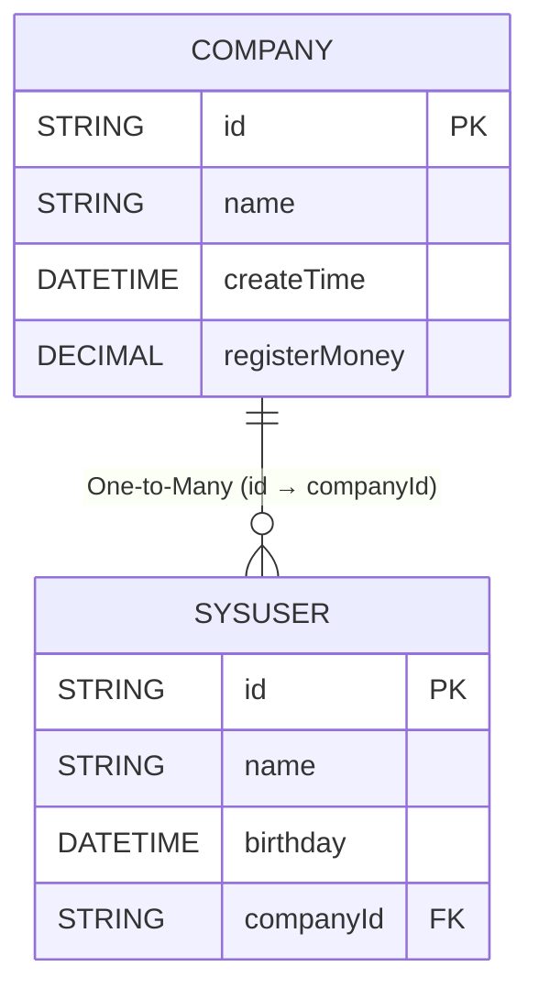

## 前言
前面在[快速体验](./quick-start.md)章节中，我们知道了`eq`的简单查询，下面我们将讲解复杂查询

在讲解复杂查询前，我们需要知道快速体验给出的是普通sql模式的查询,但是对象模式查询是使用了对象关系,

- `sql的显示模式`开发者需要显式调用`手动join`和`手动in(subQuery)`
- `对象关系的隐式`开发者只需要关注对象模型关系,框架给出`自动的join`和`自动的in(subQuery)`

任意两张表如果可以join那么他们之前一定存在关系,只是这个关系是否是临时的是否是动态的,当两张表甚至多张表有对应的关系,那么可以针对这几张表进行对象模型的关系描述使用`@Navigate`注解声明
来描述两张表之前是`一对一`、`一对多`、`多对一`、`多对多、
一款优秀的ORM框架需要具备`sql的显示模式`风格和`对象关系的隐式`风格，即支持使用面向对象的方法来处理简单查询，也可以使用 DSL 来构建复杂查询。
`eq`则是具备这两种风格，`eq`处理提供了强大的查询能力，允许开发者构建复杂的查询条件外，
也支持使用`@Table`表示实体类与表的关系，对于表之间的关联关系则是使用`@Navigate`注解声明，
`eq`提供`include`或者`includes`方法来额外自动查询出当前主表所关联的的表数据，
默认情况下，查询主表的数据时，不使用`include`或者`includes`方法是不会自动查询关联表的数据的

<!-- 以下情况不需要调用`include`或者`includes`

- 返回`对一导航属性`而不是`对多`包括相关列,其中`对一`包括`多对一`,`一对一`
- 返回导航属性本身`.select(o->o.parent())`
- 返回导航属性的列比如`.select(o->o.parent().id())`
- 返回对多的导航属性比如`.select(o->o.roles().toList())` -->


## 数据准备

对`Company`和`SysUser`表进行对象模型的关系编写一对多,`Company`表中填写的是和`SysUser`的关系,反之用户表填写的是和企业表的关系多对一

::: tabs

@tab 关系图



@tab Company
```java
@Data
@Table("t_company")
@EntityProxy
@FieldNameConstants
public class Company implements ProxyEntityAvailable<Company , CompanyProxy> {
    /**
     * 企业id
     */
    @Column(primaryKey = true)
    private String id;
    /**
     * 企业名称
     */
    private String name;

    /**
     * 企业创建时间
     */
    private LocalDateTime createTime;

    /**
     * 注册资金
     */
    private BigDecimal registerMoney;

    /**
     * 企业拥有的用户
     */
    @Navigate(value = RelationTypeEnum.OneToMany,
            selfProperty = {Company.Fields.id},
            targetProperty = {SysUser.Fields.companyId})
    private List<SysUser> users;
}
```
@tab SysUser
```java

@Data
@Table("t_user")
@EntityProxy
@FieldNameConstants
public class SysUser implements ProxyEntityAvailable<SysUser , SysUserProxy> {
    /**
     * 用户id
     */
    @Column(primaryKey = true)
    private String id;
    /**
     * 用户姓名
     */
    private String name;
    /**
     * 用户出生日期
     */
    private LocalDateTime birthday;

    /**
     * 用户所属企业id
     */
    private String companyId;

    /**
     * 用户所属企业
     */
    @Navigate(value = RelationTypeEnum.ManyToOne,
            selfProperty = {SysUser.Fields.companyId},
            targetProperty = {Company.Fields.id})
    private Company company;
}
```

:::


## 快速体验预览


### 筛选用户条件是企业


```java
List<SysUser> userInHz = easyEntityQuery.queryable(SysUser.class)
                .where(u -> {
                    //隐式子查询会自动join用户表
                      //根据条件是否生效自动添加企业表的join
                        u.company().name().eq("杭州公司");
                }).toList();
```


### 筛选企业条件是用户

```java

//筛选企业条件是企业内有至少一个用户是小明
List<Company> companyHasXiaoMing = easyEntityQuery.queryable(Company.class)
            .where(c -> {
                //筛选条件为企业所属用户里面有一个叫做小明的
                c.users().any(user -> {
                    user.name().eq("小明");
                });
            }).toList();
```
