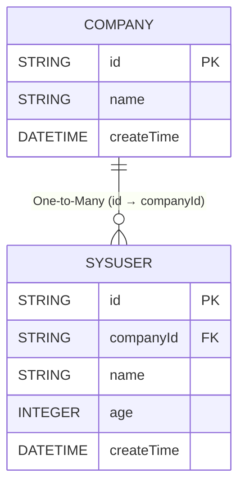

# select子查询
`easy-query`可以轻松的实现`select 子查询`,并且有手动和自动两种方式具体sql如下

实现sql
```sql
select a,b,c,(select count(t1.id) from a t1) as xx from b
```

## 数据库对象模型
::: code-tabs
@tab 关系图


@tab 企业表
```java
@Table("t_company")
@Data
@EntityProxy
@FieldNameConstants
@EasyAlias("com")
public class Company implements ProxyEntityAvailable<Company , CompanyProxy> {
    @Column(primaryKey = true)
    private String id;
    private String name;
    private LocalDateTime createTime;

    @Navigate(value = RelationTypeEnum.OneToMany,targetProperty = SysUser.Fields.companyId)
    private List<SysUser> users;
}
```

@tab 用户表
```java
@Table("t_user")
@Data
@EntityProxy
@FieldNameConstants
@EasyAlias("user")
public class SysUser implements ProxyEntityAvailable<SysUser , SysUserProxy> {
    @Column(primaryKey = true)
    private String id;
    private String companyId;
    private String name;
    private Integer age;
    private LocalDateTime createTime;


    @Navigate(value = RelationTypeEnum.ManyToOne,selfProperty = Fields.companyId)
    private Company company;
}
```
::: 

## 自动模式
查询企业id和企业下有多少个用户
```java

List<Draft2<String, Long>> list = easyEntityQuery.queryable(Company.class)
        .where(com -> com.name().like("xx公司"))
        .select(com -> Select.DRAFT.of(
                com.id(),
                com.users().count()
        )).toList();

SELECT
    t.`id` AS `value1`,
    (SELECT
        COUNT(*) 
    FROM
        `t_user` t2 
    WHERE
        t2.`company_id` = t.`id`) AS `value2` 
FROM
    `t_company` t 
WHERE
    t.`name` LIKE '%xx公司%'
```


查询企业id和企业下有多少个姓李的用户数

```java

List<Draft2<String, Long>> list = easyEntityQuery.queryable(Company.class)
        .where(com -> com.name().like("xx公司"))
        .select(com -> Select.DRAFT.of(
                com.id(),
                com.users().where(user->user.name().likeMatchLeft("李")).count()
        )).toList();
        

SELECT
    t.`id` AS `value1`,
    (SELECT
        COUNT(*) 
    FROM
        `t_user` t2 
    WHERE
        t2.`company_id` = t.`id` 
        AND t2.`name` LIKE '李%') AS `value2` 
FROM
    `t_company` t 
WHERE
    t.`name` LIKE '%xx公司%'
```

查询企业id和企业下姓李的用户年龄总和
```java

List<Draft2<String, Integer>> list = easyEntityQuery.queryable(Company.class)
        .where(com -> com.name().like("xx公司"))
        .select(com -> Select.DRAFT.of(
                com.id(),
                com.users().where(user->user.name().likeMatchLeft("李")).sum(x->x.age())
        )).toList();


SELECT
    t.`id` AS `value1`,
    IFNULL((SELECT
        SUM(t2.`age`) 
    FROM
        `t_user` t2 
    WHERE
        t2.`company_id` = t.`id` 
        AND t2.`name` LIKE '李%'),
    0) AS `value2` 
FROM
    `t_company` t 
WHERE
    t.`name` LIKE '%xx公司%'
```
## 优化
`select子查询`如果在大数量的情况下默认性能不是很理想,那么是否有性能比较高的使用方式呢,比如在分页下面我们先对结果集进行筛选在进行`select子查询`,亦或者先对结果集进行limit在进行select子查询那么性能将大大的提升,那么如何使用呢,在新版本2.0.78+版本`eq`提供了`limitSelect`和`toPageSelectResult`来方便用户处理实现这种操作

### 未优化版本
```java

EasyPageResult<Draft2<String, Integer>> pageResult = easyEntityQuery.queryable(Company.class)
        .where(com -> com.name().like("xx公司"))
        .select(com -> Select.DRAFT.of(
                com.id(),
                com.users().where(u -> u.name().likeMatchLeft("李")).sum(u -> u.age())
        )).toPageResult(2, 10);

//获取count
SELECT 
    COUNT(*) 
FROM 
    `t_company` t 
WHERE 
    t.`name` LIKE '%xx公司%'

//获取结果
SELECT
    t.`id` AS `value1`,
    IFNULL((SELECT
        SUM(t2.`age`) 
    FROM
        `t_user` t2 
    WHERE
        t2.`company_id` = t.`id` 
        AND t2.`name` LIKE '李%'),
    0) AS `value2` 
FROM
    `t_company` t 
WHERE
    t.`name` LIKE '%xx公司%' LIMIT 10 OFFSET 10
```

### 优化版本
```java
//select的操作放到单独一个匿名表达式
EasyPageResult<Draft2<String, Integer>> pageResult = easyEntityQuery.queryable(Company.class)
                .where(com -> com.name().like("xx公司"))
                .toPageSelectResult(q -> {
                    return q.select(com->Select.DRAFT.of(
                            com.id(),
                            com.users().where(u -> u.name().likeMatchLeft("李")).sum(u -> u.age())
                    ));
                },2, 10);


//获取count
SELECT 
    COUNT(*) 
FROM 
    `t_company` t 
WHERE 
    t.`name` LIKE '%xx公司%'

//获取结果
SELECT
    t1.`id` AS `value1`,
    IFNULL((SELECT
        SUM(t3.`age`) 
    FROM
        `t_user` t3 
    WHERE
        t3.`company_id` = t1.`id` 
        AND t3.`name` LIKE '李%'),
    0) AS `value2` 
FROM
    (SELECT
        t.`id`,
        t.`name`,
        t.`create_time` 
    FROM
        `t_company` t 
    WHERE
        t.`name` LIKE '%xx公司%' LIMIT 10 OFFSET 10) t1
```
区别就是将子查询额外放到了外面以最小颗粒来实现高性能子查询

### 优化版本分步查询
```java
//创建表达式
EntityQueryable<CompanyProxy, Company> queryable = easyEntityQuery.queryable(Company.class)
            .where(com -> com.name().like("xx公司"));

//获取total            
long total = queryable.cloneQueryable().count();
//先进行limit在进行select
List<Draft2<String, Integer>> data = queryable.cloneQueryable().limitSelect(10, 10, com -> Select.DRAFT.of(
        com.id(),
        com.users().where(u -> u.name().likeMatchLeft("李")).sum(u -> u.age())
)).toList();
```

### 优化原始版本分布查询
```java
 EntityQueryable<CompanyProxy, Company> queryable = easyEntityQuery.queryable(Company.class)
                .where(com -> com.name().like("xx公司"));
long total = queryable.cloneQueryable().count();
//limit+select+select就是limitSelect的默认实现如果你是低版本可以通过这种方式调用来实现优化子查询
List<Draft2<String, Integer>> data = queryable.cloneQueryable().limit(10, 10)
        .select(com -> com)
        .select(com -> Select.DRAFT.of(
                com.id(),
                com.users().where(u -> u.name().likeMatchLeft("李")).sum(u -> u.age())
        )).toList();
```

## 手动模式
::: code-tabs
@tab 对象模式
```java
@Data
@EntityProxy
public class TopicSubQueryBlog implements ProxyEntityAvailable<TopicSubQueryBlog , TopicSubQueryBlogProxy> {
    private String id;
    private Integer stars;
    private String title;
    private LocalDateTime createTime;
    private Long blogCount;

}

:::


::: code-tabs
@tab 对象模式
```java
        List<TopicSubQueryBlog> list = easyEntityQuery.queryable(Topic.class)
                .where(o -> o.title().isNotNull())
                .select(o->{
                    TopicSubQueryBlogProxy r =new TopicSubQueryBlogProxy();
                    r.selectAll(o);
                    Query<Long> subQuery = easyEntityQuery.queryable(BlogEntity.class).where(x -> x.id().eq(o.id())).selectCount();//count(*)
                    r.blogCount().setSubQuery(subQuery);
                    return r;
                }).toList();

==> Preparing: SELECT t.`id`,t.`stars`,t.`title`,t.`create_time`,(SELECT COUNT(*) FROM `t_blog` t1 WHERE t1.`deleted` = ? AND t1.`id` = t.`id`) AS `blog_count` FROM `t_topic` t WHERE t.`title` IS NOT NULL
==> Parameters: false(Boolean)
<== Time Elapsed: 6(ms)
<== Total: 99
        
```
:::


## sum连表统计

::: code-tabs
@tab 对象模式
```java

        List<TopicSubQueryBlog> list = easyEntityQuery.queryable(Topic.class)
                .where(o -> o.title().isNotNull())
                .select(o->new TopicSubQueryBlogProxy()
                    .selectAll(o)
                    .blogCount().setSubQuery(//SUM(t1.`star`)
                            easyEntityQuery.queryable(BlogEntity.class).where(x -> x.id().eq(o.id())).select(x -> new LongProxy(x.star().sum()))
                        )
                ).toList();

==> Preparing: SELECT t.`id`,t.`stars`,t.`title`,t.`create_time`,(SELECT SUM(t1.`star`) FROM `t_blog` t1 WHERE t1.`deleted` = ? AND t1.`id` = t.`id`) AS `blog_count` FROM `t_topic` t WHERE t.`title` IS NOT NULL
==> Parameters: false(Boolean)
<== Time Elapsed: 6(ms)
<== Total: 99
        
```
:::

`max`、`min` 同理