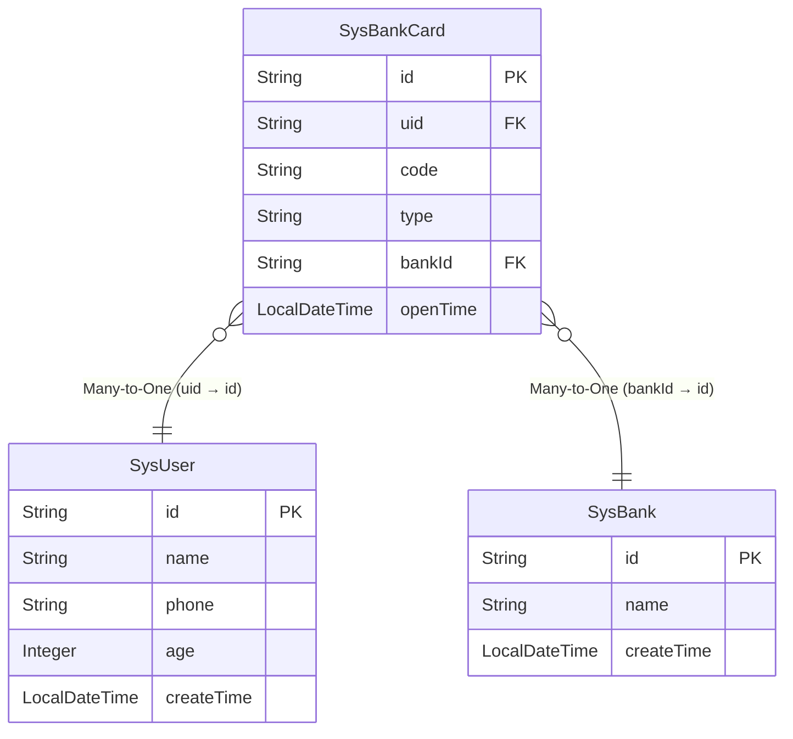

# 支持
您的支持是我坚持的动力,在这里希望您可以免费给我点个`star`

[GITHUB](https://github.com/xuejmnet/easy-query)

[GITEE](https://gitee.com/xuejm/easy-query)

## 爱心
如果您觉得这个框架有用可以请作者喝杯咖啡

<!-- 
::: code-tabs
@tab 对象模式

@tab lambda模式
@tab proxy模式
@tab 属性模式

::: 

::: tip 说明!!!
> 代理模式下`where`的第一个参数是`filter`过滤器,第二个参数开始才是真正的表
:::

::: tabs

@tab entity

编写中...
@tab lambda
编写中...
@tab client
编写中...

:::

接口  | 功能  
---  | --- 
ValueConverter  | 将数据库和对象值进行互相转换的接口
\<TProperty>  | 对象属性类型
\<TProvider>  | 数据库对应的java类型

-->